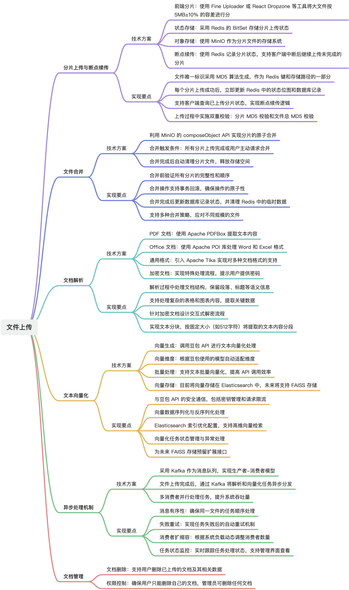
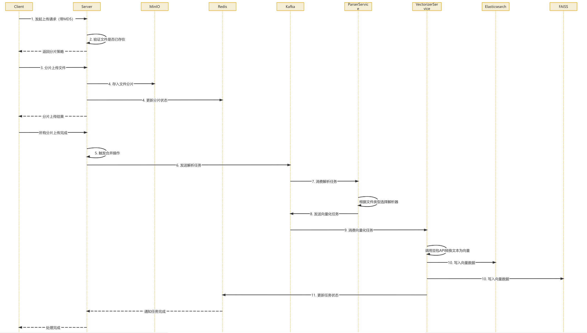
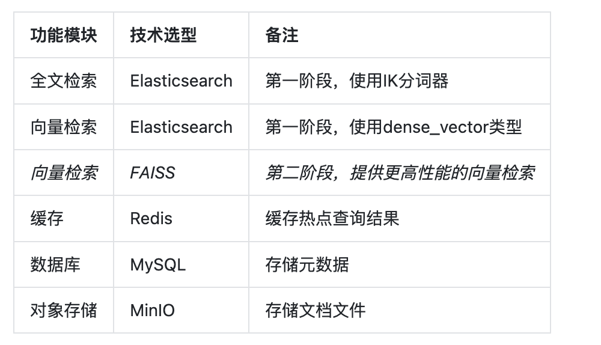

# 新版本拟采用技术说明

## 1. 文档说明

| 项目 | 内容 |
| :--- | :--- |
| 文档名称 | 新版本拟采用技术说明 |
| 版本 | v0.2 |
| 日期 | 2026-04-18 |
| 面向对象 | 甲方业务负责人、项目负责人、产品经理、实施团队 |
| 文档定位 | 用于向甲方说明新版本建设中拟采用的新技术方向、应用场景与业务价值 |
| 文档风格 | 甲方汇报稿，强调技术方向、业务目标、价值和边界，不展开底层实现细节 |

### 1.1 编写目的

在上一阶段系统建设中，平台已经完成了成果管理、项目过程管理、流程引擎、权限体系等核心基础能力。本次新版本的重点，不是推翻原有技术架构，而是在现有稳定架构上，引入更适合当前业务目标的新技术能力。

本文件用于向甲方回答以下问题：

- 新版本会继续沿用哪些成熟技术基础。
- 新版本重点引入哪些新技术。
- 这些新技术分别服务于哪些业务场景。
- 这些技术带来的价值是什么。
- 哪些能力属于辅助增强，而非全自动决策。

### 1.2 核心结论

新版本的技术升级思路可以概括为：

**保留现有稳定业务底座，在其上增加“文档识别能力 + AI 理解能力 + 智能匹配能力 + 外部线索采集能力 + 规则协同能力 + 主题标准化能力”六类新技术支撑。**

可进一步明确为：

- 科研成果管理系统中的 `需求洞察`、`研究洞察`、`成果物自动补全` 将在下一版本正式交付。
- 项目过程管理系统中的 `合同识别` 仍按既定节奏并行推进，作为另一系统的提效能力。
- 所有新技术统一定位为辅助识别、辅助判断和人工确认，不替代业务人员最终决策。

---

## 2. 当前技术基础保持不变

为了保证项目连续性、稳定性和交付可控性，新版本不会整体替换原有成熟技术底座，而是在以下基础上继续建设：

### 2.1 前端与后端基础架构

- 前端继续采用 Vue 3 + Element Plus。
- 后端继续采用 Spring Boot + MyBatis。
- 数据库仍以 MySQL 为主。
- 缓存能力继续基于 Redis。
- 相关动态字段配置为 Strapi。

### 2.2 项目过程管理底座

- 流程引擎继续采用 Camunda BPM。
- 身份认证与权限管理继续采用 Keycloak。

### 2.3 保持不变的原因

之所以保持这些基础架构不变，是因为它们已经承载了现有系统的主流程能力，具备以下优势：

- 架构成熟，风险可控。
- 已完成系统集成和现网适配。
- 有利于把新版本资源集中投入到真正需要增强的业务能力上。

因此，本次“新技术”强调的是能力增强，而不是技术底座重构。

---

## 3. 新技术迭代

### 3.1 项目文档上传与解析模块

#### 3.1.1 核心功能设计

#### 3.1.2 数据流转与存储设计

文件从上传到向量化完成的完整流程：

- 客户端计算文件 MD5，发起上传请求→服务端验证文件是否已存在，返回分片策略
- 客户端根据策略分片上传文件
- 服务端接收分片，存入 MinIO 并更新 Redis 状态
- 所有分片上传完成后，触发合并操作
- 合并完成后发送解析任务到 Kafka→解析服务消费任务，根据文件类型选择相应解析器提取文本
- 文本分块后发送向量化任务到 Kafka→向量化服务消费任务，调用豆包API 将文本转换为向量表示
- 向量数据写入 Elasticsearch 和预留 FAISS 接口→更新任务状态，通知用户处理完成

3.1.3 相关技术采用
MySQL

- 文件主表(file_upload)：存储文件元信息，如 MD5、名称、大小、状态
- 分片表(chunk_info)：记录每个分片的信息，包括索引、MD5、存储路径
- 解析结果表(document_vectors)：存储文本分块和向量化结果的元数据

Redis

- 使用 BitSet 记录已上传分片的位图（SETBIT命令）； 存储上传任务的临时状态和进度； 缓存热点文件的元数据，减轻数据库压力

MiniIO

- 临时分片：存储上传的文件分片，路径结构为/temp/{fileMd5}/{chunkIndex}
- 完整文件：合并后的文件存储在/documents/{userId}/{fileName}
- 存储策略：实现热冷数据分离

ES

- 存储文本向量数据和原始文本内容，索引基于文件 MD5 和分块 ID 组织

3.2 知识库检索设计方案
知识库检索模块是派聪明这个 RAG 项目的核心功能模块，我们是基于 Elasticsearch 实现的文档混合检索能力，将语义检索和关键词检索结果结合起来，为用户提供更高质量的搜索体验。
该模块依赖于文件上传与解析模块完成的向量化处理，直接使用存储在 Elasticsearch 中的向量数据进行检索。系统目前使用豆包 API 生成文本向量，并将向量存储在 Elasticsearch 中。

3.2.1 模块两大类
①、知识库检索

- 混合检索：结合语义检索和关键词检索结果，按权重排序返回搜索结果
- 支持指定返回结果数量：通过 topK 参数控制结果数量

②、权限控制

- 此部分要连接keyclock
- 基于组织标签的数据权限：确保用户只能访问有权限的文档
- 支持层级权限验证：父标签权限自动包含所有子标签文档的访问权限
- 默认标签全局可访问：DEFAULT 标签资源对所有用户开放

## 4. 新技术与两个系统的对应关系

| 新技术 | 科研成果管理系统 | 项目过程管理系统 | 主要价值 |
| :--- | :--- | :--- | :--- |
| 文档解析与 OCR | 成果物自动补全 | 合同识别 | 降低录入和核对成本 |
| 大模型与自然语言理解 | 需求摘要、研究热点归纳、成果附件文本理解 | 合同摘要 | 提高文本理解和归纳能力 |
| 语义匹配与向量检索 | 需求与成果匹配、研究主题聚合 | 暂不作为主场景 | 提高匹配相关性 |
| 白名单数据采集与调度 | 需求洞察 | 不作为本次主场景 | 建立外部线索入口 |
| 规则 + AI 组合判断 | 补全、标签、匹配解释 | 合同字段抽取与展示 | 提高稳定性与可控性 |
| 主题词标准化与知识组织 | 需求洞察、研究洞察 | 暂不作为主场景 | 统一主题表达和趋势口径 |

---

## 5. 下一版本内的技术支撑重点

### 5.1 直接支撑下一版本正式交付的技术能力

下一版本内，以下技术能力需要直接支撑科研成果管理系统三项正式交付：

- 用文档解析与 OCR 支撑成果物自动补全的附件识别与预填。
- 用白名单数据采集与调度支撑需求洞察的外部线索采集。
- 用大模型与自然语言理解支撑需求摘要、标签生成和研究热点总结。
- 用语义匹配与向量检索支撑需求与成果的候选匹配。
- 用规则 + AI 组合判断支撑结果可解释和人工确认流程。
- 用主题词标准化支撑研究洞察中的热点归类与趋势口径统一。

### 5.2 后续持续增强的技术方向

在下一版本完成正式交付后，后续可持续增强以下深度能力：

- 扩大成果附件识别的格式和类型覆盖范围。
- 增加更多白名单数据源和更细粒度的数据治理能力。
- 增强主题聚类、标杆对比和趋势分析深度。
- 优化匹配排序、解释质量和人工反馈学习机制。

---

## 6. 对甲方可感知的技术价值

从甲方视角看，这些新技术并不只是“技术升级”，而是直接对应业务结果的提升。

### 6.1 对科研成果管理系统

- 让成果录入更轻量。
- 让外部需求发现更主动。
- 让成果转化匹配更有依据。
- 让管理层看到更清晰的方向视图。

### 6.2 对项目过程管理系统

- 让合同上传和审核更高效。
- 让关键条款识别更快。
- 让流程节点中的人工工作更聚焦于确认，而不是重复翻阅材料。

### 6.3 对整体项目

- 在不推翻原有系统的前提下增强系统能力。
- 让新版本既体现技术先进性，又保持交付稳定性。
- 更适合作为后续持续升级的平台型能力建设。

---

## 7. 技术采用原则

建议本次新技术引入坚持以下原则：

### 7.1 以业务价值为先

不是为了“上 AI”而上 AI，而是围绕成果转化、成果录入提效、合同提效和管理洞察这些明确目标引入技术。

### 7.2 以现有架构为底座

不推翻既有成熟架构，在现有前后端、流程引擎和权限体系上做增强。

### 7.3 以可控交付为原则

优先建设可验收、可解释、可人工确认的能力，不追求一步到位的全自动化。

### 7.4 以辅助判断为边界

所有新技术统一坚持辅助识别、辅助判断、人工确认，不把技术输出直接等同于业务结论。

---

## 8. 风险与边界提示

### 8.1 数据基础风险

如果成果标签、主题词、需求标签缺少统一口径，研究洞察和需求匹配的质量会受到影响。

### 8.2 数据源稳定性风险

如果外部公开来源更新规则变化较大，需求洞察的数据持续性会受到影响，因此下一版本建议坚持白名单策略。

### 8.3 预期管理风险

如果把新技术理解为“完全自动化决策”，将直接推高验收预期。因此，需要持续强调人工确认边界。

---

## 9. 最终建议

建议与甲方形成以下统一技术结论：

**新版本不重做底座，而是在现有稳定架构上，通过文档解析、自然语言理解、语义匹配、白名单采集、规则 + AI 和主题标准化等技术，直接支撑科研成果管理系统在下一版本正式交付需求洞察、研究洞察、成果物自动补全三项能力，并并行支撑项目过程管理系统的合同识别能力。**
