# 科研成果管理系统用户操作手册

## 文档信息

| 项目 | 内容 |
| :--- | :--- |
| 文档名称 | 科研成果管理系统用户操作手册 |
| 版本 | v1.0 |
| 编写日期 | 2026-04-30 |
| 适用对象 | 科研人员、专家审核人、系统管理员、实施交付人员 |
| 适用范围 | 科研成果管理系统当前交付版本 |
| 文档定位 | 面向最终用户的系统操作说明，用于上线培训、日常使用和交付验收辅助 |

## 目录

1. 系统概述
2. 功能菜单说明
3. 登录与退出
4. 普通用户操作说明
5. 专家用户操作说明
6. 管理员操作说明
7. 状态与字段说明
8. 推荐业务流程
9. 常见问题
10. 当前版本功能边界
11. 使用建议
12. 附录：演示账号信息

## 1. 系统概述

科研成果管理系统用于支撑科研成果的录入、归集、审核、检索、权限申请、成果类型配置、过程成果查看以及需求洞察、研究洞察等业务场景。

系统当前主要面向三类角色：

| 角色 | 系统角色标识 | 主要职责 |
| :--- | :--- | :--- |
| 普通用户 | `project_leader` | 创建成果物、提交审核、查看个人成果、检索成果、申请查看受限成果全文 |
| 专家用户 | `research_expert` | 查看待审核成果、下载附件、填写审核意见、执行审核通过或驳回 |
| 管理员 | `research_admin` | 查看科研看台、管理成果、分配审核人、处理权限申请、配置成果类型和动态字段、查看过程成果和研究洞察 |

## 2. 功能菜单说明

不同角色登录后可见菜单不同，以系统实际授权为准。

### 2.1 普通用户菜单

| 菜单 | 功能说明 |
| :--- | :--- |
| 个人概览 | 查看个人成果统计、成果类型分布、近年产出趋势和最近提交成果 |
| 创建成果物 | 新建科研成果，填写基础信息、上传附件并提交审核 |
| 个人成果物 | 查看本人创建的成果，按状态和关键词查询 |
| 科研成果 | 浏览机构内可见成果 |
| 成果检索 | 按标题、关键词、类型、作者、年份、项目等条件检索成果 |
| 需求洞察 | 查看外部需求线索及系统匹配的候选成果（等待下一版本） |

### 2.2 专家用户菜单

| 菜单 | 功能说明 |
| :--- | :--- |
| 创建成果物 | 专家也可作为成果提交人创建成果 |
| 科研成果 | 浏览可见成果 |
| 成果检索 | 检索可见成果 |
| 需求洞察 | 查看需求线索与匹配结果（等待下一版本） |
| 成果审核 | 查看待审核和已审核成果，并提交审核意见 |

### 2.3 管理员菜单

| 菜单分组 | 子菜单 | 功能说明 |
| :--- | :--- | :--- |
| 创建成果物 | 创建成果物 | 新建成果并提交审核 |
| 科研看台 | 科研看台 | 查看全局成果统计、成果分布、年度趋势和最新入库成果 |
| 成果物 | 科研成果 | 浏览成果卡片列表 |
| 成果物 | 成果检索 | 组合条件检索成果，支持导出 |
| 成果物 | 过程成果 | 查看从过程管理系统同步的过程成果及附件 |
| 审核与权限 | 成果审核 | 管理员也可执行专家审核操作 |
| 审核与权限 | 权限审核 | 审批用户查看受限成果全文的申请 |
| 审核与权限 | 审核分配 | 对待分配成果执行单条或批量分配审核人 |
| 科技助手 | 需求洞察 | 查看需求线索、摘要、标签和成果匹配结果 |
| 科技助手 | 研究洞察 | 查看研究热点词云和关键词关联图谱（等待下一版本） |
| 系统配置 | 成果类型配置 | 新增、编辑成果类型，并配置动态字段 |

说明：`系统设置`入口当前版本标记为开发中，暂不作为正式可用功能纳入操作说明。

## 3. 登录与退出

### 3.1 登录系统

1. 在浏览器中打开科研成果管理系统地址。
2. 如当前未登录，系统自动跳转到统一登录门户。
3. 在统一登录门户完成身份认证。
4. 系统验证登录票据后自动返回科研成果管理系统。
5. 系统根据用户角色进入默认页面：
   - 管理员默认进入`科研看台`。
   - 专家默认进入`成果审核`。
   - 普通用户默认进入`个人概览`。

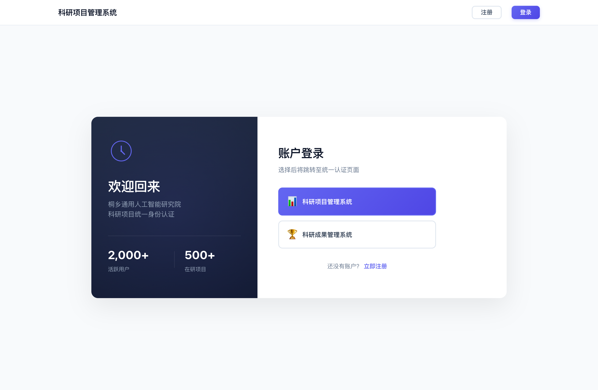

### 3.2 退出登录

1. 点击页面右上角用户信息区域。
2. 在下拉菜单中点击`退出登录`。
3. 系统弹出确认框，点击`确定`。
4. 系统清除本地登录信息并跳转回登录门户。

### 3.3 无权限提示

如果用户直接访问无权限页面，系统会跳转到`403`页面。出现该情况时，请确认账号是否具备对应角色权限。

## 4. 普通用户操作说明

### 4.1 查看个人概览

操作路径：`个人概览`

普通用户进入系统后，可在个人概览页面查看：

- 总成果数
- 论文数
- 专利数
- 本月新增成果数
- 成果类型分布图
- 近年成果产出趋势图
- 最近提交的成果列表

可点击页面中的`新建成果`进入成果创建流程，也可点击`查看全部`进入个人成果物列表。

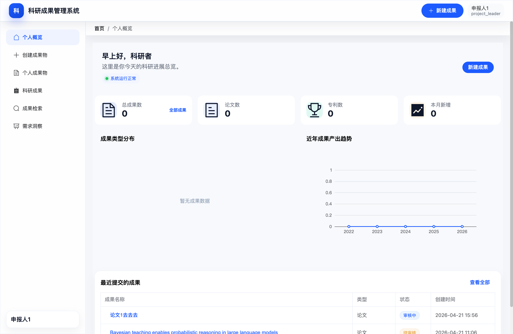

### 4.2 创建成果物

操作路径：`创建成果物`

成果创建采用分步式流程，当前包含五个步骤：`选择类型`、`填写基础信息`、`上传附件`、`智能补全`、`提交`。

#### 4.2.1 选择成果类型

1. 进入`创建成果物`页面。
2. 在`选择成果类型`下拉框中选择成果类型。
3. 系统会展示该类型的说明信息。
4. 点击`下一步`。

注意事项：

- 只展示已启用的成果类型。
- 如果管理员未配置某类成果的动态字段，系统会提示该类型暂未配置动态字段。

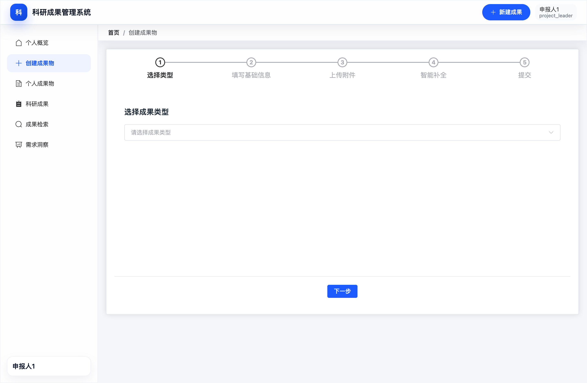

#### 4.2.2 填写基础信息

1. 填写`成果标题`。
2. 填写或选择`作者`，支持多作者。
3. 选择`年份`。
4. 填写`摘要`。
5. 填写`关键词`，可输入后按回车添加多个关键词。
6. 如当前成果类型配置了动态字段，继续填写页面展示的扩展字段。
7. 点击`下一步`。

必填校验：

- `成果标题`为必填项。
- `作者`为必填项。
- `年份`为必填项。
- 管理员配置为必填的动态字段需要填写后才能进入下一步。

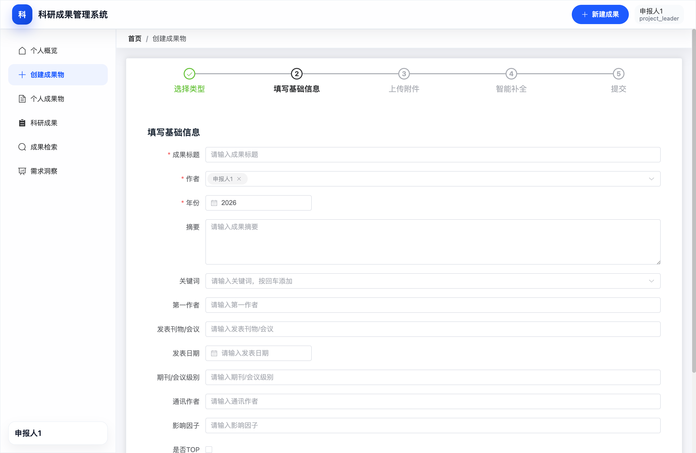

#### 4.2.3 上传附件与设置可见范围

1. 在`附件上传`区域点击上传，或将文件拖拽到上传区域。
2. 系统支持一次选择多个附件。
3. 设置成果`可见范围`：
   - `私有`：默认范围，未授权用户只能查看有限信息或需要申请访问。
   - `公开`：具备访问权限的用户可查看公开内容。
4. 点击`下一步`。

附件限制：

- 当前前端限制单个附件大小不能超过 20MB。
- 如附件超过限制，系统会提示`单个附件不能超过 20MB`并移除该文件。
- 过程管理系统同步文件的服务端配置允许 `pdf`、`doc`、`docx`、`xls`、`xlsx`、`txt`、`zip`、`rar` 等类型，普通成果附件以页面实际上传结果为准。

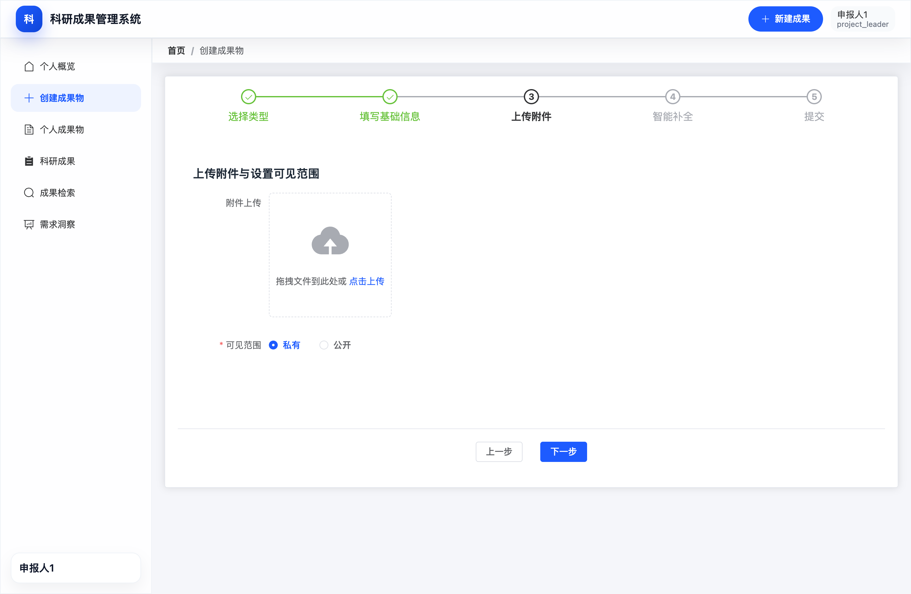

#### 4.2.4 智能补全

当前版本页面保留`智能补全`步骤，但功能状态显示为`暂未开发`。用户无需在该步骤填写内容，直接点击`下一步`进入确认提交。

交付说明：

- 当前版本不应将智能补全作为正式可操作功能验收。
- 如后续版本开放，手册应单独补充附件识别、字段预填和人工确认流程。

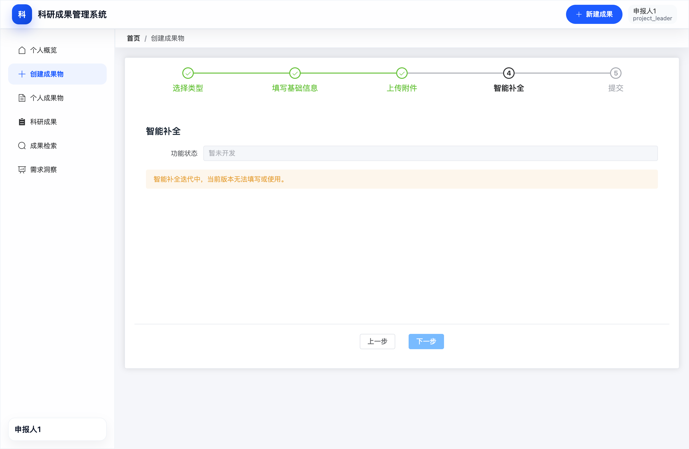

#### 4.2.5 确认并提交审核

1. 在`确认信息`页面核对成果标题、成果类型、作者、年份、摘要、关键词、可见范围、扩展信息和附件列表。
2. 确认无误后点击`提交审核`。
3. 系统提示`提交成功`后，自动跳转到`个人成果物`页面。
4. 新提交成果状态通常为`待审核`。

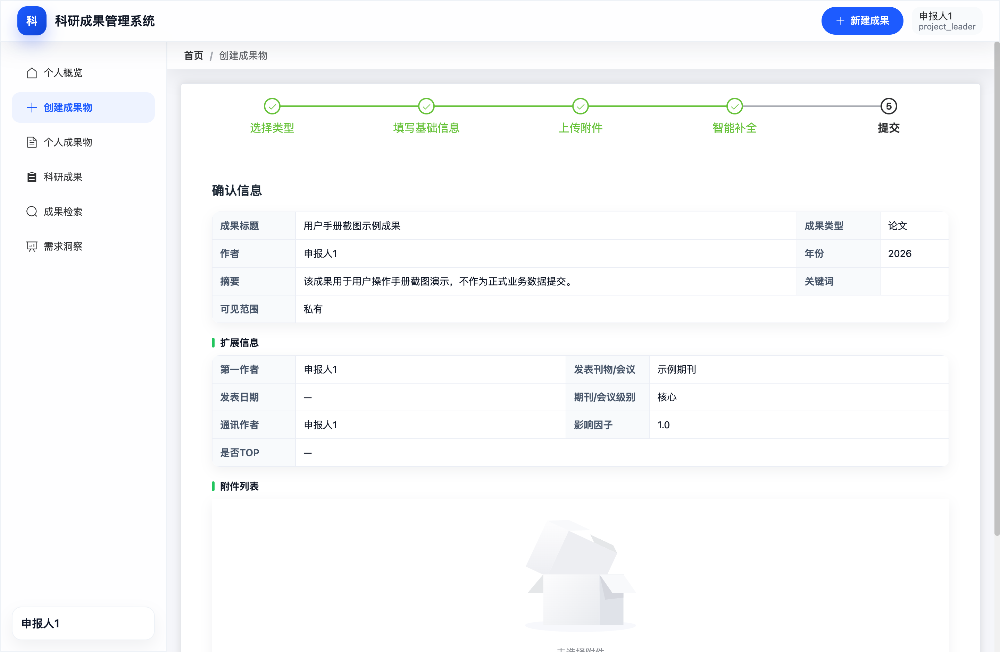

### 4.3 查看个人成果物

操作路径：`个人成果物`

页面支持按以下条件筛选：

- 状态：全部、草稿、待审核、审核中、已驳回、已发布
- 关键词

列表展示内容包括：

- 成果名称
- 类型
- 状态
- 驳回理由
- 所属项目
- 可见范围
- 创建时间

可执行操作：

| 操作 | 说明 |
| :--- | :--- |
| 查看详情 | 进入成果详情页 |
| 编辑 | 进入成果编辑页面 |
| 修改可见范围 | 当前页面按钮已保留，但功能提示为开发中 |

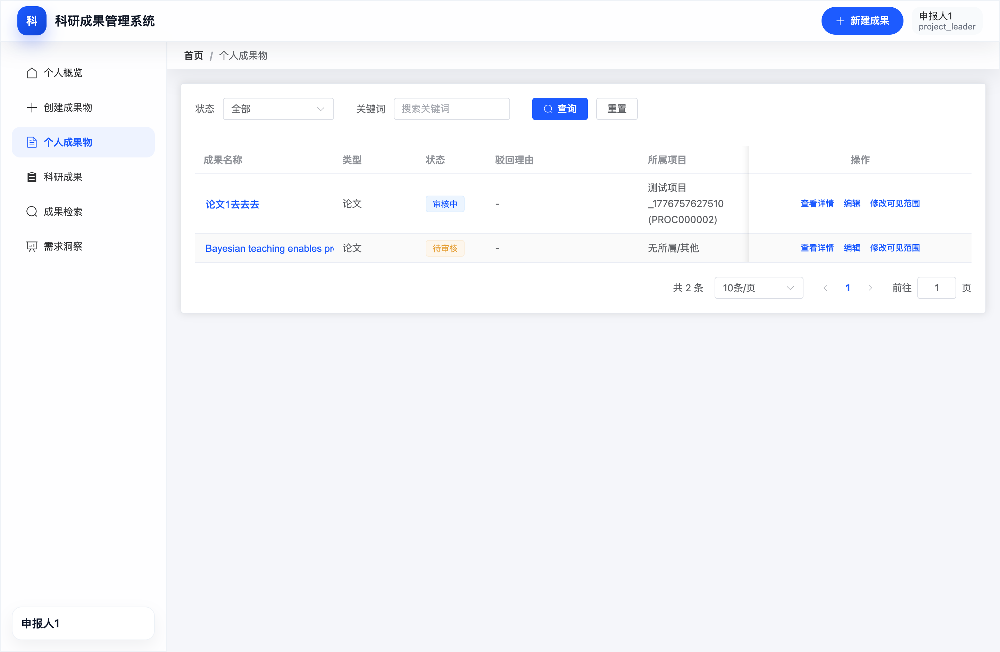

### 4.4 编辑成果

操作路径：`个人成果物` -> `编辑`

编辑页面与创建页面类似，支持修改基础信息、动态字段、附件和可见范围。完成后点击`保存修改`。

注意事项：

- 对于被驳回成果，建议先在详情页或个人成果物列表查看驳回理由，再进入编辑页面修改。
- 编辑保存后，以系统实际状态流转为准。

### 4.5 浏览科研成果

操作路径：`科研成果`

用户可在科研成果页面浏览成果卡片，并按以下条件筛选：

- 成果类型
- 年份范围：全部、近1年、近3年、近5年

点击成果卡片可进入成果详情页。

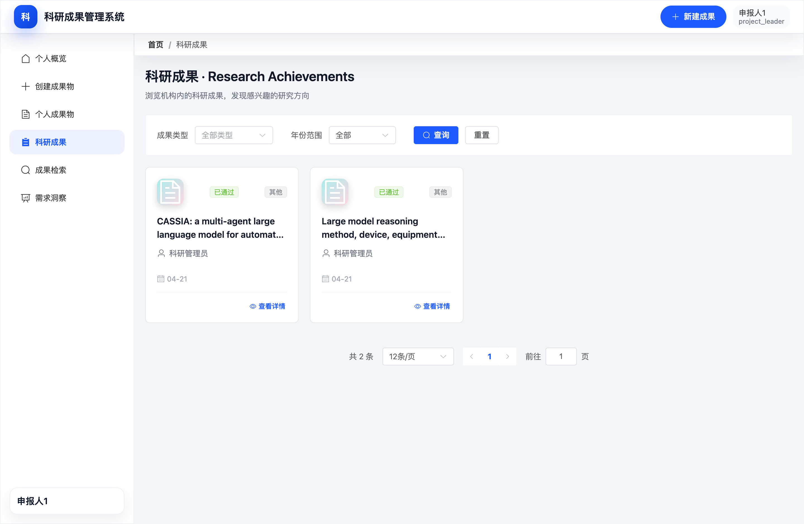

### 4.6 成果检索

操作路径：`成果检索`

成果检索支持组合条件查询：

| 查询条件 | 说明 |
| :--- | :--- |
| 成果名称 | 输入成果标题或标题片段 |
| 关键词 | 输入一个或多个关键词，多个关键词可用空格分隔 |
| 成果类型 | 从已启用成果类型中选择 |
| 作者 | 输入作者姓名 |
| 年份范围 | 选择开始年份和结束年份 |
| 项目 | 输入项目名称或项目编号 |

操作步骤：

1. 输入或选择查询条件。
2. 点击`查询`。
3. 在结果列表中点击成果名称或`查看详情`。
4. 点击`重置`可清空条件并重新查询。

说明：

- 管理员在该页面可看到`导出`按钮，普通用户和专家用户不显示导出按钮。
- 管理员点击`导出`后，系统按当前检索条件下载 Excel 文件。

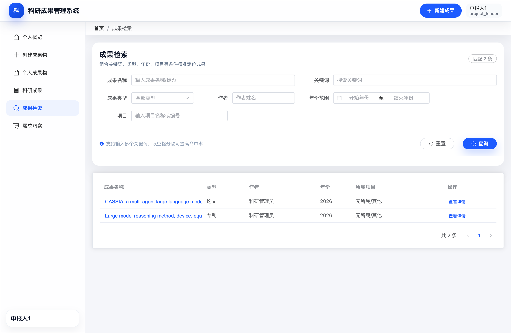

### 4.7 查看成果详情与申请全文访问

操作路径：成果列表或检索结果 -> `查看详情`

成果详情页展示：

- 成果标题、状态、来源
- 作者、年份、可见性
- 摘要
- 正文或动态扩展字段
- 附件材料
- 基本信息
- 所属项目
- 关键词
- 驳回反馈

#### 4.7.1 已授权访问

如果用户拥有完整权限，页面显示`已授权访问`，可查看正文并下载附件。

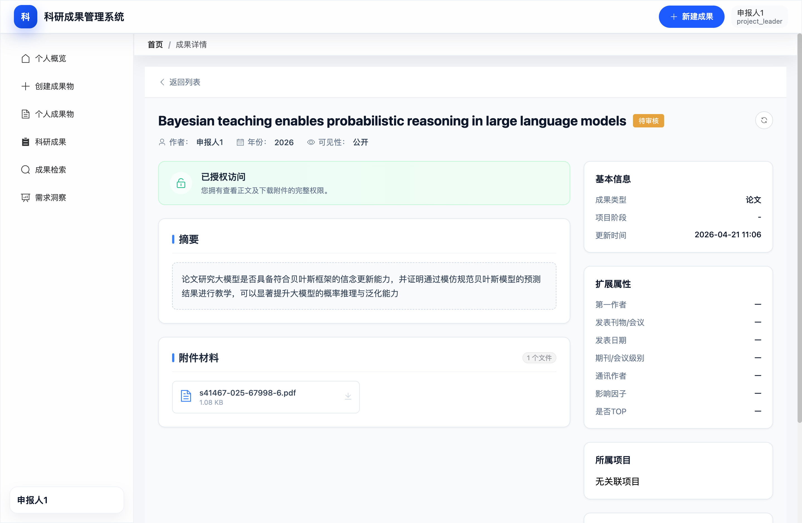

#### 4.7.2 访问受限

如果成果内容受限，页面会显示`访问受限`。此时用户可执行：

1. 点击`申请查看全文`。
2. 在弹窗中填写申请理由，最多 200 字。
3. 点击`提交申请`。
4. 提交后状态变为`审核中`，等待管理员审批。

审批结果：

- 管理员通过后，用户可查看正文及下载附件。
- 管理员拒绝后，页面显示`已拒绝`或拒绝原因，用户可补充理由后重新申请。

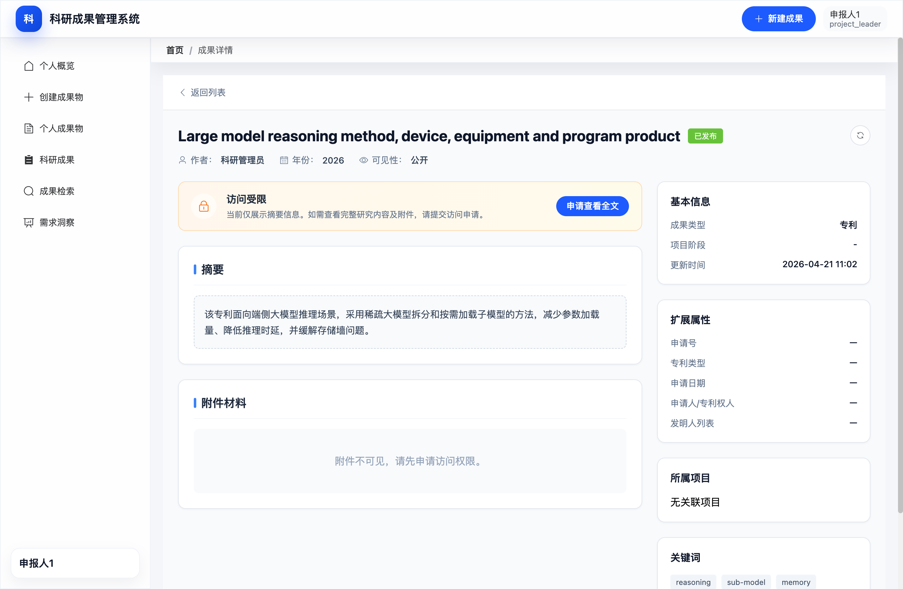

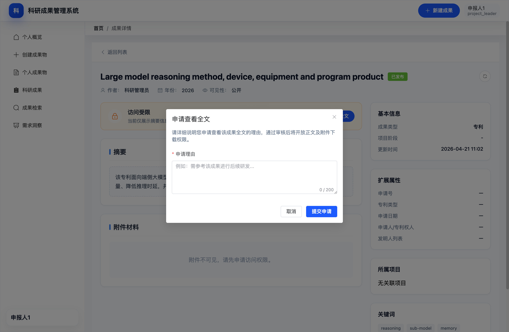

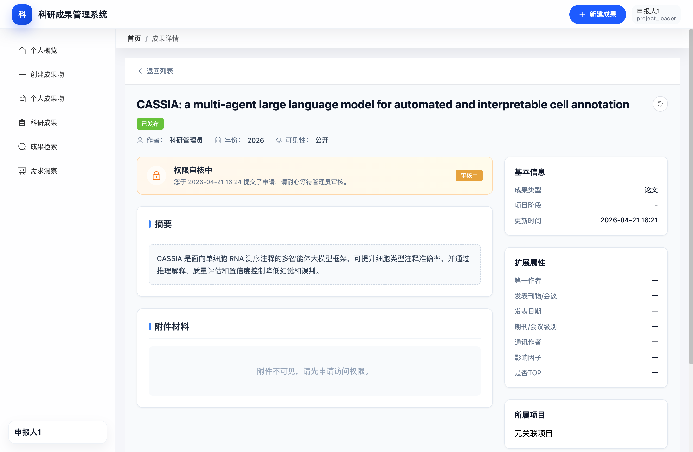

### 4.8 需求洞察

操作路径：`需求洞察`

需求洞察页面用于查看外部企业、政府平台、招投标网站等来源的需求线索，并查看系统匹配的候选成果。

#### 4.8.1 查询需求

页面支持以下筛选条件：

| 条件 | 说明 |
| :--- | :--- |
| 关键词 | 查询需求标题、摘要、行业等内容 |
| 行业 | 选择行业分类 |
| 地域 | 选择需求地域 |
| 状态 | 未匹配、已匹配、跟进中 |
| 来源类型 | 政府/园区平台、招投标网站、企业官网/年报、垂直行业论坛/新闻 |

操作步骤：

1. 输入筛选条件。
2. 点击`查询`。
3. 点击`重置`可清空筛选条件。
4. 点击右上角`刷新`可重新加载列表。

#### 4.8.2 查看需求详情与匹配成果

1. 在需求列表中点击需求行或`查看匹配`。
2. 系统从右侧打开`需求详情与匹配`抽屉。
3. 查看需求摘要、智能摘要、关键词、来源链接和匹配成果。
4. 如需重新计算匹配结果，点击`重新匹配`。
5. 在匹配结果中点击`查看成果`可进入对应成果详情页。

说明：

- 匹配度以百分比或分值形式展示，仅作为辅助参考。
- 是否跟进需求仍需业务人员人工判断。

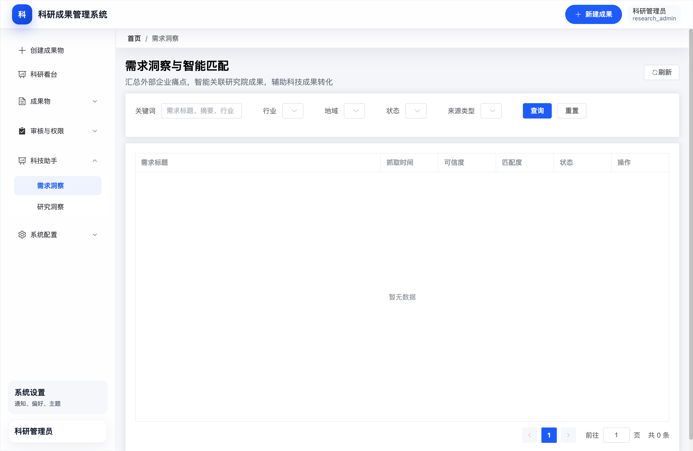

## 5. 专家用户操作说明

### 5.1 查看待审核成果

操作路径：`成果审核`

专家审核页面包含两个页签：

| 页签 | 说明 |
| :--- | :--- |
| 待审核 | 展示分配给当前专家且尚未审核的成果 |
| 已审核 | 展示当前专家已处理的成果 |

待审核列表展示：

- 成果名称
- 类型
- 所属项目
- 提交人
- 提交时间

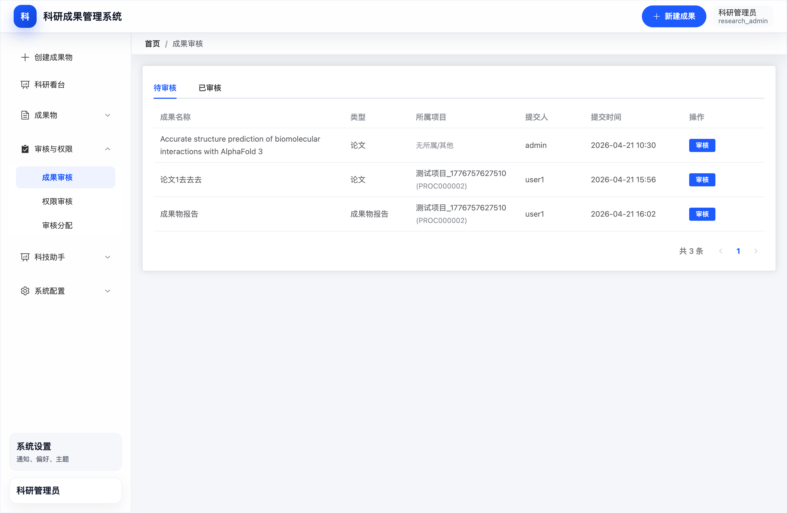

### 5.2 审核成果

操作步骤：

1. 在`待审核`页签中找到目标成果。
2. 点击`审核`。
3. 系统弹出`审核成果`对话框。
4. 查看成果标题、类型、年份、所属项目、提交人、作者、关键词、摘要等信息。
5. 如需查看完整页面，点击`查看完整详情`。
6. 如成果带附件，可在附件列表中点击`下载`。
7. 在`审核意见`中填写意见。
8. 在`审核结果`中选择`通过`或`驳回`。
9. 点击`提交`。

注意事项：

- 审核意见为必填项。
- 选择`驳回`时，应明确说明退回原因，便于提交人修改。
- 提交成功后，系统提示`审核成功`并刷新列表。

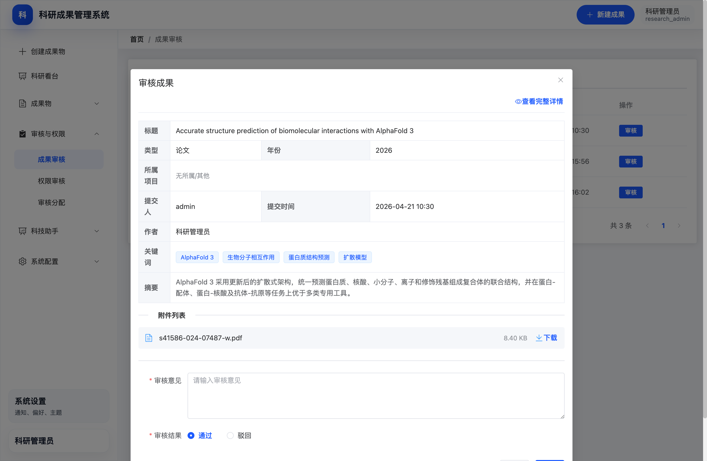

### 5.3 查看已审核记录

操作路径：`成果审核` -> `已审核`

已审核列表展示：

- 成果名称
- 类型
- 所属项目
- 审核结果
- 审核时间

审核结果显示为`通过`或`驳回`。

## 6. 管理员操作说明

### 6.1 科研看台

操作路径：`科研看台`

科研看台用于查看全局成果统计和趋势，包括：

- 总成果数
- 论文数
- 专利数
- 本月新增
- 成果分布图
- 成果年度趋势图
- 最新入库成果

可点击`查看全部`进入`成果管理`页面。

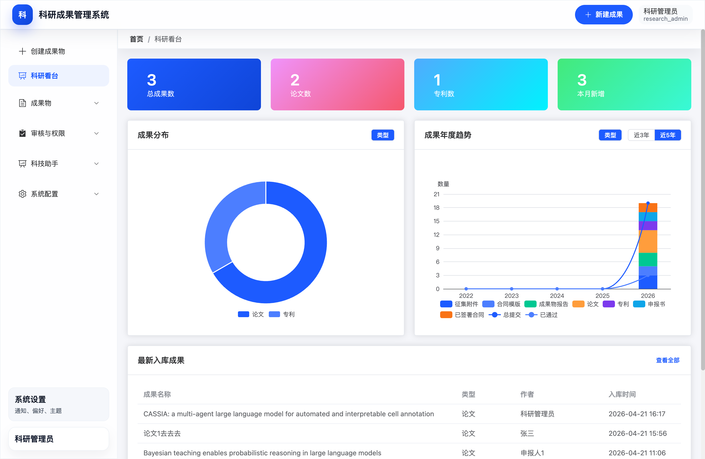

### 6.2 成果管理

操作路径：`科研看台` -> `最新入库成果` -> `查看全部`

说明：`成果管理`页面当前有独立页面和按钮入口，但不在管理员左侧`成果物`菜单中直接展示。管理员也可由系统配置的管理入口直接进入该页面。

成果管理页面支持按以下条件筛选：

| 条件 | 可选值 |
| :--- | :--- |
| 关键词 | 输入成果相关关键词 |
| 状态 | 待审核、审核中、退回修改、已发布、已驳回 |
| 来源 | 手工上传、过程管理系统 |

列表展示：

- 成果名称
- 类型
- 项目阶段
- 来源
- 格式审查状态
- 审核状态
- 创建时间

可执行操作：

| 操作 | 适用场景 | 说明 |
| :--- | :--- | :--- |
| 查看 | 所有成果 | 打开成果详情页 |
| 分配审核 | 过程管理系统来源且状态为待审核 | 选择审核人并分配 |
| 格式审查通过 | 过程管理系统来源成果 | 标记格式审查通过 |
| 格式退回 | 过程管理系统来源成果 | 填写格式问题说明并退回 |
| 编辑 | 所有成果 | 进入成果编辑页面 |
| 删除 | 所有成果 | 删除前系统会弹出确认框 |

风险提示：

- 删除成果属于高风险操作，确认前请核对成果名称和业务影响。
- 格式退回时应填写清晰的问题说明，例如缺少章节编号、摘要格式不规范等。

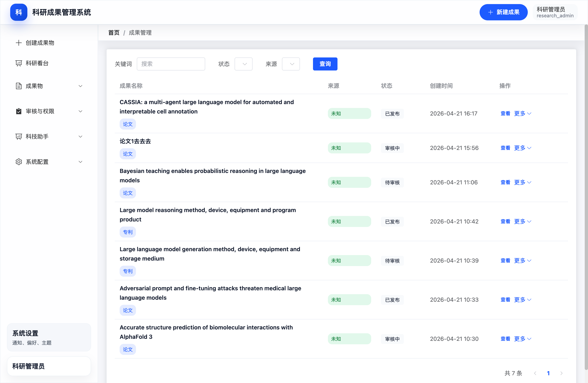

### 6.3 审核分配

操作路径：`审核与权限` -> `审核分配`

审核分配页面用于对待审核成果指定审核人。

#### 6.3.1 单条分配

1. 进入`待分配`页签。
2. 找到目标成果。
3. 点击`单条分配`。
4. 在弹窗中选择审核人。
5. 点击`确定`。

#### 6.3.2 批量分配

1. 在`待分配`页签勾选多个成果。
2. 点击`批量分配审核人`。
3. 在弹窗中选择审核人。
4. 点击`确定`。
5. 系统提示成功数量，如部分失败会给出提示。

#### 6.3.3 查看已分配记录

切换到`已分配审核`页签，可查看：

- 成果名称
- 成果类型
- 成果物提交人
- 已分配审核人名称
- 分配日期

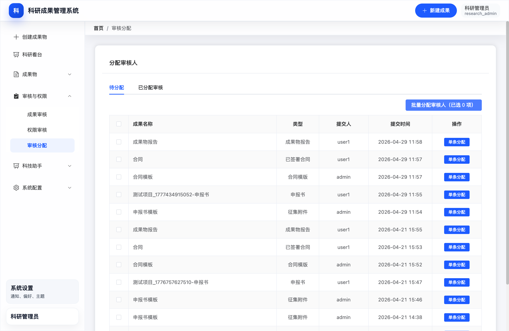

### 6.4 权限审核

操作路径：`审核与权限` -> `权限审核`

权限审核用于处理用户查看受限成果全文的申请。

#### 6.4.1 查询申请

支持筛选：

- 关键词：搜索成果或申请人
- 状态：待审核、已通过、已拒绝

点击`查询`加载结果，点击`重置`清空筛选条件。

#### 6.4.2 审批通过

1. 找到状态为`待审核`的申请。
2. 点击`通过`。
3. 系统提示`已通过申请`。
4. 申请人再次进入成果详情页后，可查看正文和下载附件。

#### 6.4.3 审批拒绝

1. 找到状态为`待审核`的申请。
2. 点击`拒绝`。
3. 在弹窗中填写拒绝理由。
4. 点击`确定`。
5. 系统提示`已拒绝申请`。

注意事项：

- 拒绝理由为必填项。
- 建议拒绝理由写明具体原因，例如申请理由不充分、缺少安全承诺等。

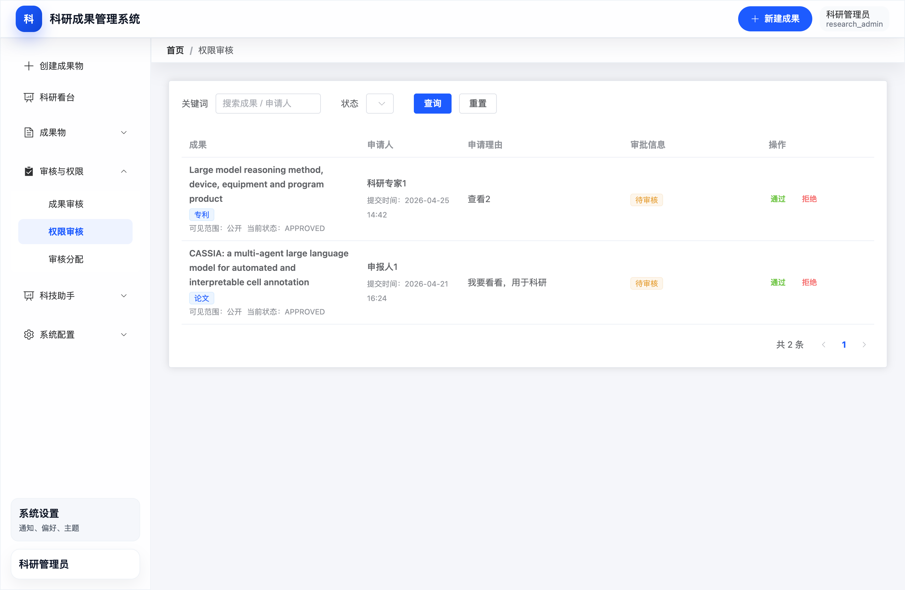

### 6.5 成果类型配置

操作路径：`系统配置` -> `成果类型配置`

成果类型配置用于维护系统可选择的成果类型，并为不同类型配置扩展字段。

#### 6.5.1 新增成果类型

1. 点击`新增类型`。
2. 填写`类型名称`，例如论文、专利、软著。
3. 填写`类型代码`，例如 `paper`。建议使用小写英文和下划线。
4. 填写`描述`。
5. 设置`启用状态`。
6. 点击`立即创建`。

注意事项：

- 类型名称和类型代码为必填项。
- 类型代码是系统内部唯一编码，创建后编辑时不可修改。
- 如果类型代码重复或网络异常，系统会提示创建失败。

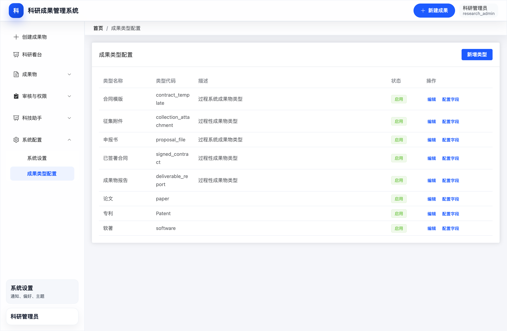

#### 6.5.2 编辑成果类型

1. 在成果类型列表中点击`编辑`。
2. 修改类型名称、描述或启用状态。
3. 点击`保存修改`。

说明：

- 编辑时`类型代码`不可修改。
- 停用后的类型不会在成果创建页面展示。

#### 6.5.3 配置动态字段

1. 在成果类型列表中点击`配置字段`。
2. 系统打开动态字段配置窗口。
3. 点击`新增字段`添加一行字段。
4. 填写字段信息。
5. 点击`保存配置`。

字段配置项：

| 字段 | 说明 |
| :--- | :--- |
| 字段编码 | 系统内部字段编码，例如 `paper_title`。已保存字段的编码不可编辑 |
| 字段名称 | 页面展示名称，例如论文标题 |
| 字段类型 | 可选 `TEXT`、`NUMBER`、`BOOLEAN`、`DATE`、`MEDIA`、`JSON`、`EMAIL`、`RICHTEXT`、`DATETIME` |
| 说明 | 字段帮助说明 |

注意事项：

- 字段编码和字段名称不能为空。
- 当前配置页面保存字段时默认按必填字段处理。
- 删除已保存字段前，系统会弹出确认提示。
- 动态字段保存后，会影响对应成果类型的创建和详情展示。

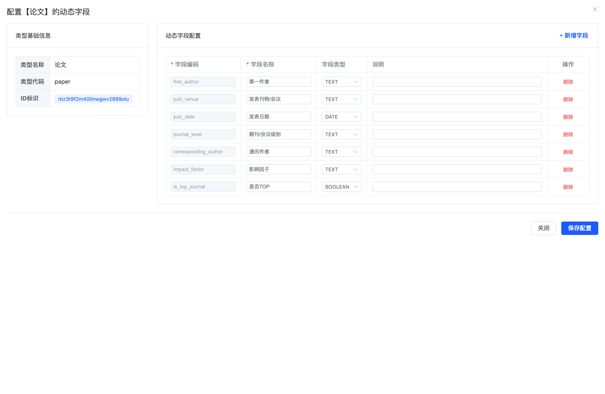

### 6.6 过程成果

操作路径：`成果物` -> `过程成果`

过程成果页面用于查看从过程管理系统同步过来的阶段性成果和附件。

页面主要区域：

| 区域 | 说明 |
| :--- | :--- |
| 顶部统计 | 展示成果物数量和项目数量 |
| 搜索框 | 按项目或成果物名称搜索 |
| 左侧项目树 | 按项目筛选 |
| 左侧类型树 | 按成果类型筛选 |
| 右侧列表 | 展示成果物名称、所属项目、附件数量、提交人、提交时间 |

#### 6.6.1 查看详情

1. 在右侧列表点击`查看详情`。
2. 系统打开成果物详情抽屉。
3. 查看成果物名称、类型、所属项目、项目编号、项目阶段、提交人、提交时间、同步时间、描述和附件列表。

#### 6.6.2 下载或预览附件

1. 在详情抽屉的附件列表中找到目标文件。
2. 点击`下载`打开或下载文件。
3. 如果文件支持在线预览，页面会显示`预览`按钮。
4. 点击`预览`在新窗口打开附件链接。

### 6.8 系统设置

当前版本左侧菜单底部可能展示`系统设置`入口，但路由标记为开发中。用户点击后系统会提示开发中并停留或返回管理页面。

交付说明：

- 当前版本不建议将`系统设置`作为正式可验收功能。
- 如后续版本开放数据源配置、通知、偏好、主题等能力，应另行补充操作章节。

## 7. 状态与字段说明

### 7.1 成果状态

| 状态 | 含义 |
| :--- | :--- |
| 草稿 | 成果尚未正式提交或处于草稿状态 |
| 待审核 | 成果已提交，等待审核或分配 |
| 审核中 | 成果已进入审核流程 |
| 退回修改 | 成果被退回，需要提交人修改 |
| 已驳回 | 审核未通过 |
| 已发布 | 审核通过并发布 |
| 已撤销 | 成果已撤销 |

### 7.2 成果来源

| 来源 | 含义 |
| :--- | :--- |
| 手工上传 | 用户在科研成果管理系统中手动创建 |
| 过程管理系统 | 由外部过程管理系统同步进入 |

### 7.3 可见范围

| 可见范围 | 含义 |
| :--- | :--- |
| 私有 | 默认受限，未授权用户可能只能查看摘要，正文和附件需申请 |
| 公开 | 面向具备系统访问权限的用户开放更多内容 |

部分历史或接口数据中可能出现`公开摘要`、`公开全文`、`站内摘要`、`站内全文`等扩展可见范围，页面会按实际值展示。

### 7.4 全文访问申请状态

| 状态 | 含义 |
| :--- | :--- |
| 未申请 | 用户尚未申请访问 |
| 待审核 | 用户已提交申请，等待管理员审批 |
| 已通过 | 管理员已授权，可查看全文和下载附件 |
| 已拒绝 | 管理员拒绝申请，用户可补充理由后重新申请 |

### 7.5 需求洞察状态

| 状态 | 含义 |
| :--- | :--- |
| 未匹配 | 需求尚未形成有效成果匹配 |
| 已匹配 | 系统已有候选成果匹配结果 |
| 跟进中 | 需求已进入人工跟进阶段 |

## 8. 推荐业务流程

### 8.1 成果提交到审核通过

1. 普通用户进入`创建成果物`。
2. 选择成果类型。
3. 填写基础信息和动态字段。
4. 上传附件并设置可见范围。
5. 跳过当前未开放的智能补全步骤。
6. 确认信息并提交审核。
7. 管理员在`审核分配`或`成果管理`中分配审核人。
8. 专家在`成果审核`中查看成果并提交审核意见。
9. 如审核通过，成果进入已发布状态。
10. 如审核驳回，提交人在`个人成果物`中查看驳回理由并修改。

### 8.2 受限成果全文访问

1. 用户在成果详情页发现访问受限。
2. 用户点击`申请查看全文`并填写申请理由。
3. 管理员进入`权限审核`查看申请。
4. 管理员选择通过或拒绝。
5. 通过后，用户可查看正文和下载附件。
6. 拒绝后，用户可根据拒绝原因重新提交申请。

### 8.3 过程成果查看

1. 过程管理系统通过接口同步过程成果。
2. 管理员进入`过程成果`。
3. 按项目、类型或关键词筛选成果。
4. 查看过程成果详情。
5. 下载或预览附件。
6. 如存在来源链接，可跳转过程管理系统查看原始信息。

## 9. 常见问题

### 9.1 登录后看不到某个菜单怎么办？

请确认当前账号是否具备对应角色。不同角色可见菜单不同。例如普通用户不能访问管理员菜单，专家用户需要具备`research_expert`角色才能进入`成果审核`。

### 9.2 创建成果时无法进入下一步怎么办？

请检查：

- 是否已选择成果类型。
- 成果标题、作者、年份是否已填写。
- 当前成果类型的必填动态字段是否已填写。

### 9.3 附件上传失败怎么办？

请检查：

- 单个附件是否超过 20MB。
- 文件是否正在被本地软件占用。
- 网络连接是否正常。
- 如仍失败，请联系管理员或实施人员查看后端上传服务。

### 9.4 为什么看不到成果正文或附件？

该成果可能为受限成果。请在成果详情页点击`申请查看全文`，填写申请理由并等待管理员审批。

### 9.5 申请全文后为什么还是不能查看？

可能存在以下情况：

- 申请仍处于`审核中`。
- 管理员已拒绝申请。
- 页面数据未刷新，可点击详情页右上角刷新按钮或重新进入页面。

### 9.6 审核人列表为空怎么办？

管理员在分配审核人时，如果审核人下拉列表为空，请确认系统中是否已配置专家或管理员账号，并确认账号角色是否正确。

### 9.7 成果类型在创建页面不显示怎么办？

请管理员进入`成果类型配置`检查：

- 类型是否已创建。
- 类型是否处于启用状态。
- 类型是否被删除或停用。

### 9.8 动态字段保存失败怎么办？

请检查：

- 字段编码是否为空。
- 字段名称是否为空。
- 字段编码是否与已有字段冲突。
- 网络连接是否正常。

## 10. 当前版本功能边界

为避免上线培训和验收过程中产生误解，当前版本应按以下边界说明：

| 功能 | 当前状态 | 建议说明 |
| :--- | :--- | :--- |
| 智能补全 | 页面保留，功能显示暂未开发 | 当前版本不作为正式可操作能力 |
| 修改可见范围 | 个人成果物列表中有入口，点击提示开发中 | 当前版本暂不开放 |
| 系统设置 | 路由标记开发中 | 当前版本暂不开放 |
| 需求洞察匹配 | 提供需求列表、详情、匹配结果和重新匹配入口 | 匹配结果为辅助参考，最终跟进由人工判断 |
| 研究洞察 | 提供关键词图谱和交互查看 | 用于辅助研判，不替代管理决策 |

## 11. 使用建议

1. 建议管理员在系统正式交付前，先完成成果类型和动态字段配置。
2. 建议准备普通用户、专家、管理员三类演示账号，用于甲方培训。
3. 建议用一条完整样例成果演示从创建、提交、分配、审核到发布的闭环流程。
4. 建议用一条私有成果演示全文访问申请和权限审批流程。
5. 建议在培训材料中明确当前未开放功能，避免用户误以为所有入口均可正式使用。

## 12. 附录：演示账号信息

以下账号仅用于交付演示、用户培训和验收测试。正式上线后，建议由甲方管理员重新设置密码或停用演示账号，避免长期使用统一默认密码。

| 角色 | 登录账号 | 登录密码 | 说明 |
| :--- | :--- | :--- | :--- |
| 管理员 | `admin` | `admin123@zjgsu` | 用于成果管理、审核分配、权限审核、成果类型配置等管理员操作演示 |
| 专家用户 | `expert1` | `admin123@zjgsu` | 用于成果审核流程演示 |
| 普通用户 | `user1` | `admin123@zjgsu` | 用于成果创建、个人成果、成果检索和访问申请流程演示 |

账号使用注意事项：

- 请勿将演示账号用于正式业务数据维护。
- 培训或验收结束后，建议立即修改密码或关闭演示账号。
- 如需提供给更多人员使用，建议为每位使用人单独创建账号，便于权限控制和操作追溯。
