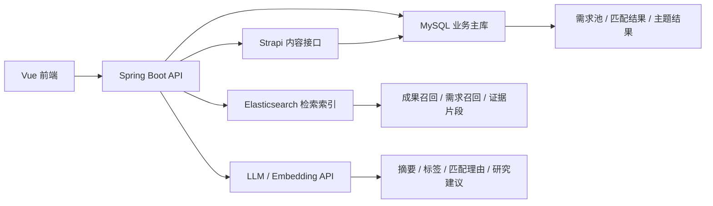
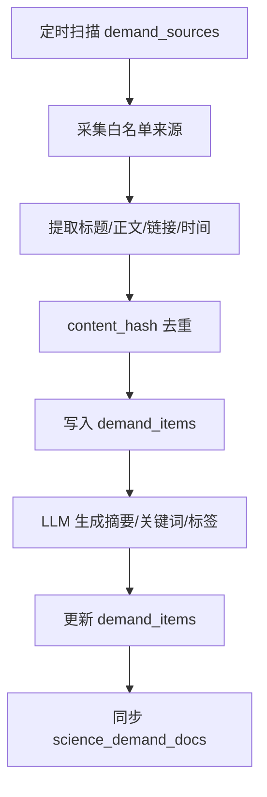
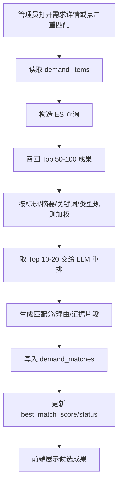
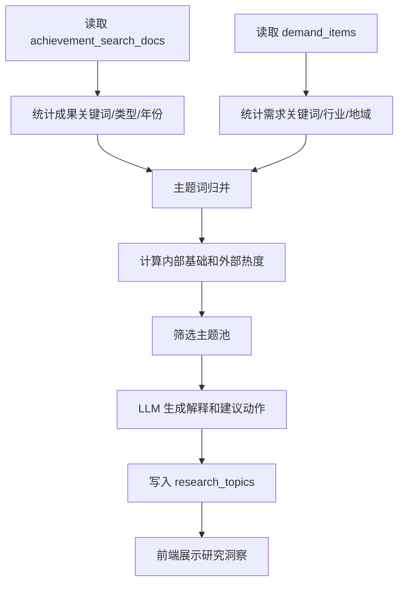

# 轻量化 ES + MySQL RAG 技术方案

## 1. 文档说明

| 项目 | 内容 |
| :--- | :--- |
| 文档名称 | 轻量化 ES + MySQL RAG 技术方案 |
| 版本 | v0.1 |
| 日期 | 2026-05-24 |
| 面向对象 | 项目负责人、后端开发、前端开发、测试、实施团队 |
| 文档定位 | 明确需求洞察与研究洞察的一期 RAG 技术选型、系统边界、落地步骤和验收口径 |
| 适用范围 | 科研成果管理系统中的需求洞察、研究洞察、成果匹配与轻量知识检索 |

## 2. 核心结论

本项目一期建议采用：

**轻量化 Elasticsearch + MySQL 的 RAG 增强方案。**

具体含义如下：

- MySQL 作为业务主库，保存需求、成果引用、匹配结果、人工确认、研究主题、任务状态等强一致业务数据。
- Elasticsearch 作为检索索引，保存可重建的成果检索文档、需求检索文档、证据片段和可选向量字段。
- Spring Boot 作为唯一业务编排层，负责权限校验、数据同步、ES 检索、LLM 调用、结果落库和接口输出。
- Strapi 继续承担已有成果内容、动态字段、附件关系和管理后台职责，不改造成 RAG 引擎。
- 一期不引入 Kafka、FAISS、Milvus、独立知识库平台、复杂分布式任务系统。

一句话概括：

**MySQL 管业务，ES 管检索，Spring Boot 管流程，LLM 管摘要和解释。**

## 3. 为什么选择轻量化 ES + MySQL

### 3.1 业务原因

需求洞察与研究洞察要解决的不是单纯“问答”问题，而是两类业务闭环：

- 需求洞察：外部需求线索入池、成果匹配、人工确认、跟进沉淀。
- 研究洞察：内部研究主题识别、外部需求信号对照、趋势解释、管理建议。

这些场景同时需要：

- 可筛选、可排序、可分页的业务数据。
- 可解释、可召回、可追溯的文本检索能力。
- 人工确认和状态流转。
- 管理层能理解的结果输出。

因此不能只依赖 LLM，也不适合只做一个通用知识库问答入口。

### 3.2 技术原因

当前代码基础已经具备：

- Spring Boot + MyBatis + MySQL 主业务后端。
- Strapi 管理成果内容和动态字段。
- 前端已有需求洞察与研究洞察页面壳。
- 后端已有 `LlmClient`，支持 Chat 和 Embedding。
- 后端已有成果详情、权限判断、附件文本提取能力。

在此基础上引入轻量 ES，能够补齐当前最缺的一层：

**从数千到上万条成果/需求文本中快速召回候选证据。**

这比让 LLM 直接扫描全量成果库更稳定，也比一开始上独立向量数据库更容易交付。

## 4. 一期建设边界

### 4.1 一期必须完成

需求洞察：

- 白名单数据源配置。
- 需求采集入池。
- 需求摘要、关键词、标签生成。
- 需求与成果的 ES 检索召回。
- 成果附件轻量文本提取，作为成果检索上下文补充。
- LLM 生成匹配理由和证据片段。
- 人工确认、状态流转、跟进记录。

研究洞察：

- 基于成果关键词、成果类型、年份、部门生成主题池。
- 结合需求池关键词形成外部需求信号。
- 生成轻量管理摘要。
- 展示内部代表成果、外部需求信号和趋势说明。

技术底座：

- MySQL 新增业务表。
- ES 新增轻量索引。
- Spring Boot 新增需求洞察与研究洞察真实接口。
- 前端从 mock 数据切换到真实接口。

### 4.2 一期暂不做

| 能力 | 一期处理 |
| :--- | :--- |
| Kafka 异步流水线 | 暂不引入，使用 Spring `@Async` 或定时任务 |
| FAISS/Milvus | 暂不引入，ES 足够支撑一期召回 |
| 复杂知识图谱 | 暂不做，研究洞察先做主题聚合 |
| 全站附件深度 chunk RAG | 暂缓，但一期做附件轻量提取：每个附件提取前 5000-10000 字，补入成果检索上下文 |
| 通用聊天式问答 | 暂不作为主交付 |
| 自动决策 | 不做，所有 AI 结果只作为辅助判断 |
| 多 ES 集群或索引别名灰度 | 暂不做，单索引可重建即可 |

## 5. 总体架构



## 6. 组件职责划分

| 组件 | 一期职责 | 不承担职责 |
| :--- | :--- | :--- |
| MySQL | 业务主数据、状态、匹配结果、主题结果、任务记录 | 大规模全文召回、向量相似度计算 |
| Elasticsearch | 成果/需求文本召回、BM25 检索、可选向量检索、证据片段索引 | 业务主库、人工确认状态、最终结论主存储 |
| Spring Boot | 接口、权限、任务、ES 同步、LLM 编排、结果落库 | 前端展示、内容建模后台 |
| Strapi | 成果内容、动态字段、附件关系、后台管理 | RAG 编排、检索排序、任务调度 |
| LLM | 摘要、关键词、标签、匹配解释、研究建议 | 直接扫描全库、替代人工决策 |
| Vue 前端 | 需求洞察和研究洞察展示、人工操作 | 直接访问 ES、直接访问私有文件 |

## 7. 数据分层设计

### 7.1 MySQL 主数据层

MySQL 负责保存不可丢失、需要审计和人工维护的数据：

- 数据源配置。
- 需求池。
- 需求匹配结果。
- 跟进记录。
- 研究主题。
- 主题证据。
- 异步任务状态。
- 成果检索文档的同步快照。

建议与已有 `RAG模块建表设计文档.md` 对齐，优先采用其中的轻量表设计：

- `achievement_search_docs`
- `demand_sources`
- `demand_items`
- `demand_matches`
- `demand_follow_ups`
- `system_tasks`
- `research_topics`

### 7.2 ES 检索索引层

ES 只保存可由 MySQL/Strapi 重建的索引数据：

- 成果标题、摘要、关键词、类型、项目名、核心动态字段。
- 成果附件名称、附件说明、附件轻量正文预览。
- 需求标题、摘要、关键词、标签、行业、地域、原文摘要。
- 证据片段。
- 可选 embedding 字段。

ES 中不保存：

- 人工确认状态。
- 跟进状态。
- 业务审批状态。
- 最终管理结论的唯一副本。

## 8. ES 索引设计

### 8.1 索引一：`science_achievement_docs`

用于成果检索召回。

字段建议：

| 字段 | 类型 | 说明 |
| :--- | :--- | :--- |
| `achievementDocId` | keyword | 成果 documentId |
| `title` | text + keyword | 成果标题 |
| `summary` | text | 成果摘要 |
| `keywordsText` | text | 关键词拼接文本 |
| `authorsText` | text | 作者拼接文本 |
| `typeCode` | keyword | 成果类型编码 |
| `typeName` | keyword/text | 成果类型名称 |
| `projectName` | text | 项目名称 |
| `year` | keyword | 年份 |
| `visibilityRange` | keyword | 可见范围 |
| `attachmentNames` | text | 附件名称拼接文本 |
| `attachmentTextPreview` | text | 附件轻量正文，单附件提取前 5000-10000 字 |
| `searchText` | text | 拼接后的检索主体 |
| `department` | keyword | 部门，若当前数据可取 |
| `updatedAt` | date | 更新时间 |
| `embedding` | dense_vector，可选 | 一期可先预留，视 ES 版本决定是否启用 |

检索主体 `searchText` 建议拼接：

```text
标题 + 摘要 + 关键词 + 成果类型 + 项目名称 + 重要动态字段值 + 附件名称 + 附件轻量正文
```

### 8.2 索引二：`science_demand_docs`

用于需求检索、研究洞察外部信号统计。

字段建议：

| 字段 | 类型 | 说明 |
| :--- | :--- | :--- |
| `demandId` | keyword | 需求 ID |
| `title` | text + keyword | 需求标题 |
| `summary` | text | 摘要 |
| `llmSummary` | text | LLM 摘要 |
| `keywordsText` | text | 关键词拼接 |
| `tagsText` | text | 标签拼接 |
| `industry` | keyword | 行业 |
| `region` | keyword | 地域 |
| `sourceSite` | keyword | 来源站点 |
| `sourceUrl` | keyword | 来源链接 |
| `capturedAt` | date | 抓取时间 |
| `status` | keyword | 需求状态 |
| `searchText` | text | 检索主体 |
| `embedding` | dense_vector，可选 | 一期可先预留 |

### 8.3 附件轻量提取策略

一期不做附件全文 chunk 级 RAG，但附件不能完全缺席。附件内容作为成果检索上下文的一部分，采用轻量提取策略。

处理范围：

- PDF。
- Word：`doc`、`docx`。
- TXT。
- Excel：`xls`、`xlsx`。

暂不处理：

- 图片。
- 视频。
- 音频。
- 压缩包。
- 二进制不可识别文件。
- 加密或损坏文件。

提取规则：

- 每个附件只提取前 5000-10000 字。
- 单个附件超过大小限制时跳过，建议一期限制为 10MB 或 20MB。
- 提取失败不影响成果主流程，只记录失败原因。
- 附件正文不单独拆分为 chunk，不单独作为独立知识文档。
- 提取后的文本写入成果检索文档的 `attachmentTextPreview`，并拼入 `searchText`。

使用方式：

```text
成果标题 + 摘要 + 关键词 + 动态字段 + 附件名称 + 附件轻量正文
 -> science_achievement_docs
 -> 需求匹配召回
 -> LLM 生成匹配理由和证据片段
```

现有后端已有基础附件提取能力：

- `achmanager-backend/src/main/java/com/achievement/utils/AttachmentContentExtractor.java`

一期可复用该类支持的 PDF、Word、TXT、Excel 提取能力，并根据实际效果将提取上限从当前轻量限制调整到 5000-10000 字范围。

### 8.4 是否启用向量字段

一期建议采用两级策略：

第一阶段：

- 先使用 ES BM25 + 字段权重。
- 不强依赖 dense_vector。
- LLM 负责 Top N 重排和解释。

第二阶段：

- 如果关键词召回质量不足，再启用 embedding。
- 使用 `LlmClient.createEmbedding(...)` 生成向量。
- ES 中增加 `dense_vector` 或按当前 ES 版本支持方式实现 kNN。

这样可以避免一期被向量维度、ES 版本、索引 mapping、embedding 成本卡住。

## 9. 需求洞察流程

### 9.1 数据源入池流程



### 9.2 需求匹配流程



### 9.3 匹配分建议

一期可以采用组合分：

| 分数来源 | 权重建议 | 说明 |
| :--- | :--- | :--- |
| ES 相关度 | 40% | 关键词、标题、摘要召回分 |
| 规则分 | 30% | 行业、关键词重叠、成果类型、年份 |
| LLM 重排分 | 30% | 对 Top 候选做语义判断 |

后端最终落库字段仍为 `match_score`，但可以保留调试字段用于后续优化。

## 10. 研究洞察流程

### 10.1 一期定位

研究洞察一期不做复杂向量聚类，先做轻量管理视图。

输入：

- 成果关键词。
- 成果类型。
- 成果年份。
- 项目名称。
- 部门或创建人信息。
- 需求池关键词。
- 需求行业、地域、时间。

输出：

- 新兴主题。
- 强势方向。
- 高潜缺口。
- 交叉方向。
- 内部代表成果。
- 外部需求信号。
- 管理摘要。

### 10.2 主题生成流程



### 10.3 主题类型判断建议

| 类型 | 判断逻辑 |
| :--- | :--- |
| 新兴主题 | 近 12 个月外部需求增长明显，内部成果较少 |
| 强势方向 | 内部成果数量高，关键词集中，近几年持续活跃 |
| 高潜缺口 | 外部热度高，内部基础弱 |
| 交叉方向 | 多个成果类型、多个部门或多个关键词簇共同出现 |

## 11. 后端接口设计

### 11.1 需求洞察接口

| 方法 | 路径 | 用途 |
| :--- | :--- | :--- |
| GET | `/demand` | 查询需求列表 |
| GET | `/demand/{id}` | 查询需求详情 |
| POST | `/demand/{id}/rematch` | 重新匹配成果 |
| PATCH | `/demand/{id}/status` | 更新需求状态 |
| POST | `/demand/{id}/confirm-match` | 确认候选成果 |
| GET | `/demand/sources` | 查询数据源健康状态 |

### 11.2 数据源接口

| 方法 | 路径 | 用途 |
| :--- | :--- | :--- |
| GET | `/system/crawler-sources` | 查询数据源 |
| POST | `/system/crawler-sources` | 新增数据源 |
| PUT | `/system/crawler-sources/{id}` | 更新数据源 |
| DELETE | `/system/crawler-sources/{id}` | 删除数据源 |
| POST | `/system/crawler-sources/{id}/test` | 测试数据源 |
| GET | `/system/crawler-settings` | 查询采集设置 |
| PUT | `/system/crawler-settings` | 更新采集设置 |

### 11.3 研究洞察接口

| 方法 | 路径 | 用途 |
| :--- | :--- | :--- |
| GET | `/research-insights/topics` | 查询主题池 |
| GET | `/research-insights/topics/{id}` | 查询主题详情 |
| GET | `/research-insights/topics/{id}/trend` | 查询主题趋势 |
| GET | `/research-insights/executive-insights` | 查询管理摘要 |
| POST | `/research-insights/rebuild` | 重新生成研究洞察 |

### 11.4 索引管理接口

| 方法 | 路径 | 用途 |
| :--- | :--- | :--- |
| POST | `/rag/index/achievements/rebuild` | 重建成果检索索引 |
| POST | `/rag/index/achievements/{documentId}` | 重建单条成果索引 |
| POST | `/rag/index/demands/{id}` | 重建单条需求索引 |
| GET | `/rag/tasks/{taskId}` | 查询任务状态 |

索引管理接口仅管理员可用。

## 12. 后端模块拆分

建议新增模块或包：

```text
com.achievement.demand
com.achievement.researchinsight
com.achievement.rag
com.achievement.search
```

### 12.1 `demand` 模块

| 类 | 职责 |
| :--- | :--- |
| `DemandController` | 需求池 API |
| `DemandSourceController` | 数据源 API |
| `DemandService` | 需求查询、状态流转 |
| `DemandCrawlerService` | 白名单采集 |
| `DemandStructuringService` | 摘要、关键词、标签 |
| `DemandMatchService` | 成果匹配 |

### 12.2 `rag/search` 模块

| 类 | 职责 |
| :--- | :--- |
| `AchievementSearchDocService` | 同步成果检索文档 |
| `EsIndexService` | ES 写入和删除 |
| `EsSearchService` | ES 查询 |
| `EmbeddingService` | 可选向量生成 |
| `SearchTextBuilder` | 构造检索文本 |

### 12.3 `researchinsight` 模块

| 类 | 职责 |
| :--- | :--- |
| `ResearchInsightsController` | 研究洞察 API |
| `ResearchTopicService` | 主题池查询 |
| `ResearchTopicBuildService` | 主题生成 |
| `ResearchTrendService` | 趋势计算 |
| `ExecutiveInsightService` | 管理摘要生成 |

## 13. 前端改造点

### 13.1 需求洞察页面

文件：

- `research-management-system/src/views/insights/DemandInsights.vue`
- `research-management-system/src/api/demand.ts`

改造任务：

- 移除 mock 数据依赖。
- 页面加载调用 `getDemands()`。
- 点击需求调用 `getDemandDetail(id)`。
- 重匹配按钮调用 `rematchDemand(id)`。
- 确认匹配调用 `confirmMatch(demandId, resultId)`。
- 状态变更调用 `updateDemandStatus(...)`。
- 数据源健康状态调用 `getDemandSources()`。
- 增加 loading、error、empty 状态。
- 去除 `Mock 演示数据` 标签。

### 13.2 研究洞察页面

文件：

- `research-management-system/src/views/admin/ResearchInsights.vue`
- `research-management-system/src/api/researchInsights.ts`

改造任务：

- 移除 mock 数据依赖。
- 页面加载调用 `getResearchTopics()`。
- 管理摘要调用 `getExecutiveInsights()`。
- 主题趋势调用 `getTopicTrend(topicId)`。
- 增加时间范围筛选。
- 内部代表成果支持跳转成果详情。
- 外部需求信号支持跳转需求详情。
- 管理员可触发重新生成研究洞察。

### 13.3 数据源管理

文件：

- `research-management-system/src/views/admin/SystemSettings.vue`
- `research-management-system/src/api/system.ts`

改造任务：

- 接入数据源 CRUD。
- 接入测试连接。
- 接入全局采集设置。
- 对认证信息做脱敏展示。

## 14. 权限与安全

### 14.1 权限原则

- 所有接口必须经过 Spring Security / Keycloak 权限校验。
- ES 查询只在后端执行。
- ES 查询结果返回前必须做二次权限判断。
- 匹配证据片段不能泄漏用户无权查看的成果全文。
- 管理员可查看完整匹配依据。
- 普通用户仅查看符合成果可见范围的摘要级信息。

### 14.2 ES 权限过滤

一期可先使用以下字段过滤：

- `visibilityRange`
- `achievement_status`
- `published_at` 同步状态
- `is_delete`
- 用户是否管理员

注意：

ES 中的权限字段只作为第一层过滤，最终仍以 MySQL/后端权限判断为准。

## 15. 实施排期

### 第 1 阶段：基础表与 ES 接入

目标：

- MySQL 表可用。
- ES 可连接。
- 单条成果可同步到 ES。

任务：

- 建表。
- 增加 ES 配置。
- 实现成果检索文档构建。
- 实现 ES 写入。
- 实现 ES 查询 demo。

### 第 2 阶段：成果检索索引

目标：

- 已审核成果可被召回。

任务：

- 同步 `achievement_search_docs`。
- 同步 `science_achievement_docs`。
- 接入附件轻量文本提取。
- 将附件名称和附件轻量正文写入成果检索文档。
- 实现单条和全量重建。
- 实现成果检索服务。

### 第 3 阶段：需求洞察闭环

目标：

- 需求池和匹配结果可真实展示。

任务：

- 实现需求数据源管理。
- 实现需求入池。
- 实现需求结构化。
- 实现需求 ES 同步。
- 实现重匹配。
- 前端需求洞察接真实接口。

### 第 4 阶段：研究洞察轻量视图

目标：

- 研究洞察不再依赖 mock。

任务：

- 实现主题聚合。
- 实现外部需求信号统计。
- 实现管理摘要生成。
- 前端研究洞察接真实接口。

### 第 5 阶段：联调与验收

目标：

- 形成可演示、可验收的一期版本。

任务：

- 权限测试。
- ES 召回质量测试。
- LLM 输出稳定性测试。
- 前端交互测试。
- 准备演示数据。

## 16. 验收标准

### 16.1 需求洞察

必须满足：

- 管理员可以管理白名单数据源。
- 系统可以生成真实需求池。
- 需求详情中有摘要、关键词、标签。
- 点击重匹配可以返回候选成果。
- 每条候选成果包含匹配分、匹配理由、证据片段。
- 管理员可以确认匹配。
- 管理员可以推进需求状态。

### 16.2 研究洞察

必须满足：

- 页面主题池来自后端真实接口。
- 主题包含内部基础、外部热度、增速。
- 主题详情包含内部代表成果。
- 主题详情包含外部需求信号。
- 管理摘要来自后端生成结果。
- 研究洞察页面不再显示 mock 标识。

### 16.3 技术验收

必须满足：

- ES 索引可重建。
- MySQL 是业务主数据来源。
- 删除或更新成果后，索引可重新同步。
- ES 查询不越权返回受限成果内容。
- LLM 调用失败时，业务接口有明确失败提示或降级结果。

## 17. 风险与控制

### 17.1 ES 召回质量不足

风险：

- 中文分词、同义词、行业词不完善，导致召回质量不稳定。

控制：

- 一期先用字段权重和关键词归一化。
- 增加领域同义词表。
- 必要时启用 embedding 检索。

### 17.2 LLM 输出不稳定

风险：

- LLM 返回格式不稳定，影响前端展示。

控制：

- 后端要求 LLM 输出 JSON。
- 后端做 JSON 校验。
- 校验失败时降级为模板化解释。

### 17.3 权限泄漏

风险：

- ES 中有成果摘要和动态字段，可能返回给无权限用户。

控制：

- ES 查询前加权限过滤。
- 返回前根据成果详情权限再校验。
- 普通用户只展示摘要级内容。

### 17.4 工程范围膨胀

风险：

- 过早引入向量库、Kafka、复杂任务调度，导致一期延期。

控制：

- 一期只采用 ES + MySQL。
- 异步任务使用 Spring `@Async` 或定时任务。
- 只做业务闭环必需能力。

## 18. 与既有文档关系

本文件用于明确技术选型和实施口径。

相关文档：

- `docs/formal/RAG模块建表设计文档.md`：作为 MySQL 表结构设计参考。
- `docs/formal/需求洞察与研究洞察RAG实施计划.md`：作为更完整的实施计划参考。
- `docs/formal/需求洞察一期产品方案.md`：作为需求洞察产品边界参考。
- `docs/formal/需求洞察与研究洞察产品边界及信息架构方案.md`：作为两个模块职责边界参考。

如文档之间存在差异，一期实施以本文档为优先口径：

**轻量化 ES + MySQL，先跑通业务闭环，再逐步增强向量检索和附件级 RAG。**

## 19. 最终建议

当前阶段推荐正式采用：

**轻量化 ES + MySQL RAG 增强方案。**

执行原则：

- MySQL 保存业务事实。
- ES 保存检索索引。
- Spring Boot 统一编排。
- Strapi 保持现有职责。
- LLM 只做辅助理解和解释。
- 所有结果保留人工确认。

该方案能够在不推翻现有架构的前提下，较快支撑需求洞察和研究洞察一期落地，同时为后续向量检索、附件级 RAG、主题聚类和更复杂的研究分析能力保留扩展空间。
