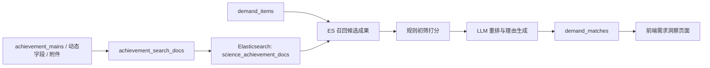

# 需求洞察 RAG 功能维护说明

版本：v0.2
日期：2026-06-01
适用范围：`achmanager-backend`、`research-management-system` 中的需求洞察 RAG 一期实现

## 1. 当前实现目标

本版本实现的是“轻量化 ES + MySQL + LLM 重排”的需求洞察 RAG 主链路：

1. 从已有成果数据构建 MySQL 检索快照。
2. 将成果快照写入 Elasticsearch。
3. 对需求文本执行 ES 候选成果召回。
4. 使用规则分做初步匹配评分。
5. 使用大模型对候选成果进行重排，并生成匹配理由、标签和证据片段。
6. 将最终匹配结果写入 `demand_matches`，供前端需求洞察页面展示。

当前版本优先支持“需求洞察”。“研究洞察”暂不接入该实时 RAG 链路，后续可复用成果索引和需求池数据做主题聚类、趋势分析和研究方向推荐。

## 2. 总体链路



核心原则：

- MySQL 保存业务数据、检索快照、匹配结果和状态。
- ES 负责成果文本召回。
- LLM 只负责 Top N 候选成果重排和解释生成，不直接替代 ES。
- LLM 调用失败时自动回退到 `ES + 规则分`，不阻断需求匹配流程。

## 3. 关键代码索引

后端配置：

- `achmanager-backend/src/main/resources/application.yaml`
- `achmanager-backend/src/main/java/com/achievement/config/RagProperties.java`
- `achmanager-backend/src/main/java/com/achievement/config/RagElasticsearchConfig.java`
- `achmanager-backend/src/main/java/com/achievement/constant/LlmUsage.java`

ES 客户端与索引：

- `achmanager-backend/src/main/java/com/achievement/client/RagElasticsearchClient.java`
- `achmanager-backend/src/main/java/com/achievement/service/IRagAchievementIndexService.java`
- `achmanager-backend/src/main/java/com/achievement/service/impl/RagAchievementIndexServiceImpl.java`
- `achmanager-backend/src/main/java/com/achievement/controller/RagController.java`

需求匹配：

- `achmanager-backend/src/main/java/com/achievement/service/IDemandInsightService.java`
- `achmanager-backend/src/main/java/com/achievement/service/impl/DemandInsightServiceImpl.java`
- `achmanager-backend/src/main/java/com/achievement/service/IDemandMatchLlmRerankService.java`
- `achmanager-backend/src/main/java/com/achievement/service/impl/DemandMatchLlmRerankServiceImpl.java`
- `achmanager-backend/src/main/java/com/achievement/controller/DemandInsightController.java`

MyBatis 与实体：

- `achmanager-backend/src/main/java/com/achievement/domain/po/AchievementSearchDoc.java`
- `achmanager-backend/src/main/java/com/achievement/domain/po/DemandItem.java`
- `achmanager-backend/src/main/java/com/achievement/domain/po/DemandMatch.java`
- `achmanager-backend/src/main/java/com/achievement/domain/po/DemandSource.java`
- `achmanager-backend/src/main/resources/mapper/AchievementSearchDocMapper.xml`
- `achmanager-backend/src/main/resources/mapper/DemandItemMapper.xml`
- `achmanager-backend/src/main/resources/mapper/DemandMatchMapper.xml`

附件提取：

- `achmanager-backend/src/main/java/com/achievement/utils/AttachmentContentExtractor.java`

前端：

- `research-management-system/src/api/demand.ts`
- `research-management-system/src/views/insights/DemandInsights.vue`

SQL：

- `sql/sql_construct/3_rag_tables.sql`
- `achmanager-backend/src/main/resources/db/migration/rag_lightweight_es_mysql_tables.sql`

## 4. 运行配置

### 4.1 ES 配置

配置项位于 `application.yaml` 的 `rag.elasticsearch`：

```yaml
rag:
  elasticsearch:
    enabled: ${RAG_ES_ENABLED:true}
    base-url: ${RAG_ES_BASE_URL:http://127.0.0.1:9200}
    username: ${RAG_ES_USERNAME:}
    password: ${RAG_ES_PASSWORD:}
    achievement-index: ${RAG_ES_ACHIEVEMENT_INDEX:science_achievement_docs}
    search-top-k: ${RAG_ES_SEARCH_TOP_K:10}
    connect-timeout-ms: ${RAG_ES_CONNECT_TIMEOUT_MS:3000}
    read-timeout-ms: ${RAG_ES_READ_TIMEOUT_MS:10000}
```

常用环境变量：

```bash
RAG_ES_BASE_URL=http://127.0.0.1:9200
RAG_ES_USERNAME=
RAG_ES_PASSWORD=
RAG_ES_ACHIEVEMENT_INDEX=science_achievement_docs
```

如果本地 ES 开启了安全认证，必须配置 `RAG_ES_USERNAME` 和 `RAG_ES_PASSWORD`。

### 4.2 LLM 配置

复用现有 `LlmClient`，当前新增了 `LlmUsage.RAG`，默认映射到 `llm.models.default`：

```yaml
llm:
  models:
    default:
      base-url: ${LLM_DEFAULT_BASE_URL:}
      api-key: ${LLM_DEFAULT_API_KEY:}
      model-name: ${LLM_DEFAULT_MODEL_NAME:}
      max-tokens: ${LLM_DEFAULT_MAX_TOKENS:4096}
      temperature: ${LLM_DEFAULT_TEMPERATURE:0.7}
  usage:
    default: default
    report: default
    rag: default
```

RAG LLM 重排配置：

```yaml
rag:
  llm:
    enabled: ${RAG_LLM_ENABLED:true}
    rerank-max-candidates: ${RAG_LLM_RERANK_MAX_CANDIDATES:8}
    temperature: ${RAG_LLM_TEMPERATURE:0.1}
    max-tokens: ${RAG_LLM_MAX_TOKENS:2048}
```

必须配置：

```bash
LLM_DEFAULT_BASE_URL=你的 OpenAI Chat Completions 兼容地址
LLM_DEFAULT_API_KEY=你的 API Key
LLM_DEFAULT_MODEL_NAME=模型名称
RAG_LLM_ENABLED=true
```

如果需要临时关闭大模型重排：

```bash
RAG_LLM_ENABLED=false
```

关闭后系统仍会使用 ES 召回和规则打分。

## 5. 数据表职责

### 5.1 `achievement_search_docs`

成果检索快照表。用于把 Strapi/成果主表中的分散字段统一整理成 ES 可索引文本。

关键字段：

- `achievement_doc_id`：成果 `documentId`
- `title`、`summary`、`type_name`、`type_code`
- `keywords_text`、`authors_text`
- `attachment_names`
- `attachment_text_preview`
- `search_text`
- `search_hash`
- `indexed_at`
- `es_doc_id`
- `es_indexed_at`
- `attachment_extract_status`

维护要点：

- ES 写入来源以该表为准。
- 成果内容变更后，需要重建该成果快照并重新写入 ES。
- `search_hash` 用于后续做增量判断，目前已生成但增量策略可以继续增强。

### 5.2 `demand_items`

需求池主表。采集器后续完成后，应把结构化需求写入该表。

关键字段：

- `title`
- `raw_content`
- `summary`
- `llm_summary`
- `keywords_json`
- `tags_json`
- `industry`
- `region`
- `source_site`
- `source_url`
- `best_match_score`
- `status`

### 5.3 `demand_matches`

需求与成果匹配结果表。

关键字段：

- `demand_id`
- `achievement_doc_id`
- `es_score`
- `rule_score`
- `llm_score`
- `match_score`
- `reason`
- `source_snippet`
- `fit_tags_json`
- `confirm_status`

当前最终分数计算：

```text
match_score = ES归一化分 * 0.5 + 规则分 * 0.2 + LLM分 * 0.3
```

如果 LLM 未启用或调用失败，则保留规则阶段生成的 `match_score`。

## 6. 附件处理策略

当前版本支持轻量附件提取，不做完整附件级分片 RAG。

支持格式：

- PDF
- Word：`doc`、`docx`
- TXT
- Excel：`xls`、`xlsx`

限制：

- 单文件最大值由 `tika.max-file-size-bytes` 控制，默认 50MB。
- 每个附件最多提取文本长度由 `tika.max-text-length` 控制，默认 100000 字符。
- 图片、音频、视频、压缩包、加密文件、损坏文件会跳过。

附件 JSON 兼容常见 Strapi media relation 形态：

- `attributes.files.data[]`
- `files.data[]`
- `files.data`
- `file.data`
- 平铺的 `files` / `file` 对象

提取结果写入：

- `achievement_search_docs.attachment_names`
- `achievement_search_docs.attachment_text_preview`
- `achievement_search_docs.search_text`

维护位置：

- `AttachmentContentExtractor.extractContents(...)`
- `RagAchievementIndexServiceImpl.buildSearchDoc(...)`

## 7. 后端接口清单

### 7.1 RAG 管理接口

基础路径：`/rag`

| 方法 | 路径 | 说明 |
|---|---|---|
| GET | `/rag/es/health` | 检查 ES 连接 |
| POST | `/rag/achievement-index/ensure` | 创建或确认成果 ES 索引 |
| POST | `/rag/search-docs/achievements/rebuild` | 重建全部已审核成果 MySQL 快照 |
| POST | `/rag/search-docs/achievements/{achievementDocId}` | 重建单个成果 MySQL 快照 |
| POST | `/rag/search-docs/achievements/{achievementDocId}/sync` | 同步单个成果 RAG 索引；已审核成果写入 ES，未审核/删除成果清理索引 |
| POST | `/rag/search-docs/achievements/index?limit=200` | 将待同步快照写入 ES |
| POST | `/rag/search-docs/achievements/rebuild-and-index` | 重建全部快照并写入 ES |
| GET | `/rag/achievements/search?keyword=xxx&topK=10` | ES 成果检索调试 |

注意：

- 索引创建、重建、写入接口要求当前用户有 `research_admin` 角色。
- `/rag/achievements/search` 主要用于调试，不建议作为前端正式检索入口。

### 7.2 需求洞察接口

基础路径：`/demand`

| 方法 | 路径 | 说明 |
|---|---|---|
| GET | `/demand?pageNum=1&pageSize=10` | 需求列表 |
| GET | `/demand/{id}` | 需求详情 |
| POST | `/demand/{id}/rematch` | 对单条需求重新匹配成果 |
| PATCH | `/demand/{id}/status` | 更新需求状态 |
| POST | `/demand/{id}/confirm-match` | 人工确认匹配结果 |
| GET | `/demand/sources` | 需求数据源列表 |
| POST | `/demand/match-preview` | 临时输入需求文本，预览匹配结果，不入库 |

`/demand/match-preview` 示例：

```json
{
  "title": "高精度织造设备在线质量检测与缺陷识别需求",
  "content": "企业希望在现有织造产线上引入视觉检测与缺陷识别能力...",
  "industry": "先进制造",
  "region": "桐乡",
  "keywords": ["机器视觉", "缺陷识别", "纺织制造"],
  "topK": 10
}
```

## 8. 标准维护流程

### 8.1 首次部署或清空 ES 后

1. 确认 MySQL 表已存在。
2. 确认 ES 已启动。
3. 确认后端 LLM 配置可用。
4. 调用：

```http
GET /rag/es/health
```

5. 管理员调用：

```http
POST /rag/search-docs/achievements/rebuild-and-index
```

6. 调试检索：

```http
GET /rag/achievements/search?keyword=机器视觉&topK=10
```

7. 对需求执行匹配：

```http
POST /demand/{id}/rematch
```

### 8.2 单个成果变更后

成果在以下场景会自动同步 RAG 索引，无需人工执行维护接口：

- 成果审核通过。
- 成果创建或更新。
- 成果附件上传、覆盖或删除。
- 成果可见范围变更。
- 成果删除、下架或不再满足“已发布 + 已审核通过 + 未删除”条件。

同步规则：

- 满足已发布、已审核通过、未删除条件时，重建 `achievement_search_docs` 并写入 ES。
- 不满足条件时，将 MySQL 检索快照标记删除，并删除 ES 中对应文档。

如果需要修复历史数据索引，可手动执行：

```http
POST /rag/search-docs/achievements/{achievementDocId}/sync
```

也可分步重建快照并写入待同步 ES 文档：

```http
POST /rag/search-docs/achievements/{achievementDocId}
POST /rag/search-docs/achievements/index?limit=20
```

### 8.3 单个需求变更后

如果需求正文、摘要、关键词、行业或地域发生变化：

```http
POST /demand/{id}/rematch
```

该接口会：

1. 从 ES 召回候选成果。
2. 软删除该需求下未确认的旧匹配结果。
3. 重新生成候选结果。
4. 更新 `demand_items.best_match_score` 和 `status`。

已人工确认的匹配不会被软删除。

## 9. 前端维护说明

需求洞察页面：

- 页面文件：`research-management-system/src/views/insights/DemandInsights.vue`
- API 文件：`research-management-system/src/api/demand.ts`

当前页面已经关闭该模块的 mock 请求：

```ts
request({ url: '/demand', method: 'get', params, mock: false })
```

因此前端运行时必须确保：

- MySQL 监听 `3306`，且 `strapi` 数据库可访问。
- Redis 监听 `6379`。
- Strapi 监听 `1337`。
- Elasticsearch 监听 `9200`。
- Keycloak 监听 `8080`，并存在 `research-management` realm 或通过环境变量覆盖。
- 后端监听 `8081`，前端开发服务监听 `5173`。
- 后端服务运行在 Vite 代理目标 `http://localhost:8081`
- 用户已登录并携带有效 token
- 后端存在需求数据或使用 `/demand/match-preview` 调试

Vite 代理配置：

```ts
"/api" -> "http://localhost:8081"
```

## 10. 常见问题排查

### 10.1 `/rag/es/health` 失败

检查：

- ES 是否启动。
- `RAG_ES_BASE_URL` 是否正确。
- ES 是否开启账号密码。
- 后端机器是否能访问 ES 地址。

本地命令：

```bash
curl http://127.0.0.1:9200
```

### 10.2 `/rag/search-docs/achievements/rebuild` 没有数据

检查：

- `achievement_mains` 中是否有 `achievement_status = 'APPROVED'` 的成果。
- 成果是否 `published_at IS NOT NULL`。
- 成果是否 `is_delete = 0`。

参考 SQL：

```sql
SELECT COUNT(*)
FROM achievement_mains
WHERE is_delete = 0
  AND published_at IS NOT NULL
  AND achievement_status = 'APPROVED';
```

### 10.3 附件没有提取内容

检查：

- 附件是否属于支持格式。
- 文件是否超过 `tika.max-file-size-bytes`，默认 50MB。
- Strapi 文件 URL 是否能被后端访问。
- `achievement_search_docs.attachment_extract_status` 和 `attachment_extract_error`。
- 后端日志中 `AttachmentContentExtractor` 的 warn 信息。

### 10.4 LLM 没有生效

检查：

- `RAG_LLM_ENABLED` 是否为 `true`。
- `LLM_DEFAULT_BASE_URL` 是否是 Chat Completions 兼容地址。
- `LLM_DEFAULT_API_KEY` 是否有效。
- `LLM_DEFAULT_MODEL_NAME` 是否正确。
- `llm.usage.rag` 是否映射到有效模型 key。

如果 LLM 调用失败，系统会回退到 ES + 规则分。可在日志中搜索：

```text
需求-成果 LLM 重排失败
```

### 10.5 前端仍显示空数据

检查：

- `demand_items` 是否已有数据。
- `/demand` 接口是否返回记录。
- 登录用户 token 是否有效。
- Vite 代理是否指向正确后端端口。

## 11. 后续扩展建议

### 11.1 采集器接入

采集器完成后，建议只负责写入或更新 `demand_items` 和 `demand_sources`，不要直接写 `demand_matches`。

推荐流程：

1. 采集数据。
2. 去重后写入 `demand_items`。
3. 生成或更新 `summary`、`llm_summary`、`keywords_json`。
4. 调用 `/demand/{id}/rematch`。

### 11.2 LLM 需求结构化

当前 LLM 只做候选成果重排。后续可以新增需求结构化服务：

- 从 `raw_content` 生成 `llm_summary`
- 抽取 `keywords_json`
- 生成 `pending_confirmations_json`
- 生成 `risk_notes_json`
- 判断 `priority` 和 `confidence`

建议独立为 `DemandLlmStructuringService`，不要塞进匹配服务。

### 11.3 增量索引

当前已具备 `search_hash` 和 `indexed_at/es_indexed_at`，并已在成果审核通过、成果保存、附件变更、删除/下架后自动同步单条成果索引。后续可以继续增强为：

- 定时任务扫描 `indexed_at > es_indexed_at` 的记录。
- 批量扫描 `is_delete = 1` 的历史快照并清理 ES 残留文档。

### 11.4 Embedding 与向量检索

当前版本没有使用 embedding。原因：

- 现阶段数据量和功能目标更适合先用 ES + LLM 重排。
- ES 关键词召回可解释性更强。
- LLM 重排已经能解决大部分语义匹配质量问题。

如果后续数据规模扩大或语义召回不足，可以考虑：

- ES BM25 + ES dense_vector 混合检索。
- MySQL 保持业务数据，ES 同时保存文本索引和向量字段。
- 对附件内容做 chunk 后再向量化。

### 11.5 研究洞察复用

研究洞察可以复用：

- `achievement_search_docs`
- `demand_items`
- `demand_matches`
- ES 成果索引
- LLM 总结能力

建议先做离线生成，不建议一开始做实时 RAG：

1. 聚合近 3-12 个月需求。
2. 聚合内部成果关键词和类型。
3. LLM 生成研究主题、机会点和证据。
4. 写入 `research_topics`。

## 12. 验证命令

后端完整测试：

```bash
cd achmanager-backend
./mvnw -q test
```

RAG/需求洞察定向测试：

```bash
cd achmanager-backend
./mvnw -q -Dtest=RagAchievementIndexServiceImplTest,DemandInsightServiceImplTest,AttachmentContentExtractorTest test
```

前端类型检查：

```bash
cd research-management-system
npm run type-check
```

前端构建：

```bash
cd research-management-system
npm run build
```

空白与补丁格式检查：

```bash
git diff --check
```

说明：`./mvnw -q test` 当前在 `test` profile 下会禁用外部 ES/LLM/初始化器依赖，可验证代码行为和核心链路。真正端到端联调仍要求 MySQL、Strapi、ES、Keycloak、后端和前端服务全部启动。
